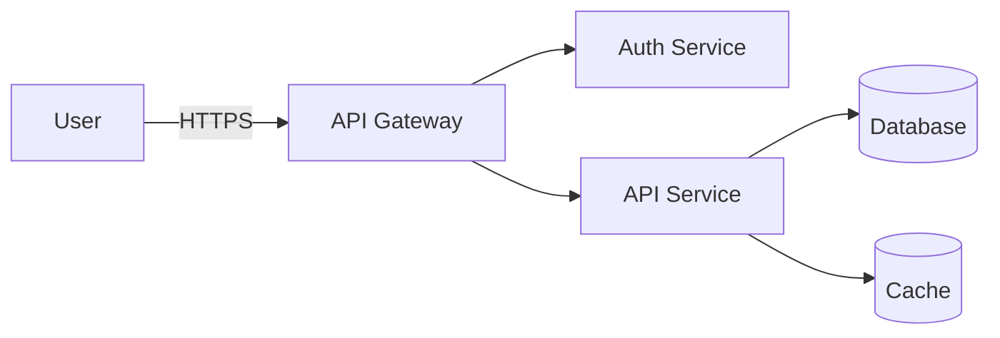

# DevOps Documentation Standards

**Elite professional standards for DevOps and SRE documentation**

---

## Overview

Effective documentation is critical in DevOps and SRE environments where:
- Teams operate 24/7 with rotating on-call schedules
- Incidents require rapid response with clear procedures
- Complex systems need accessible troubleshooting guidance
- Knowledge must transfer seamlessly across team members

This guide establishes tier-1 documentation standards based on practices from Google SRE, Netflix, Amazon, and other industry leaders.

---

## Core Principles

### 1. Documentation as Code
- Store all documentation in version control (Git)
- Use Markdown, AsciiDoc, or reStructuredText for portability
- Apply code review practices to documentation changes
- Automate documentation builds and deployments
- Keep documentation in the same repo as code when possible

### 2. Audience-First Writing
- **Operators**: Clear runbooks, quick troubleshooting steps
- **Developers**: Integration guides, API documentation
- **Leadership**: Architecture decisions, incident summaries
- **New Team Members**: Onboarding, system overviews

### 3. Just-in-Time Documentation
- Document when needed, not speculatively
- Update during incidents and post-mortems
- Keep docs close to code (README in each service)
- Prefer executable examples over prose descriptions

### 4. Discoverability
- Centralized documentation portal (Backstage, Confluence, Wiki)
- Consistent structure across services and systems
- Searchable with keywords and tags
- Linked from alerting systems and dashboards

---

## Documentation Types

### 1. Runbooks

**Purpose**: Step-by-step procedures for operational tasks

**Structure**:
```markdown
# Runbook: [Task Name]

## Overview
- **Purpose**: What this runbook accomplishes
- **Frequency**: How often this is needed (daily, weekly, on-incident)
- **Estimated Time**: How long this takes
- **Required Access**: Permissions, credentials, tools needed

## Prerequisites
- [ ] Access to production environment
- [ ] VPN connection established
- [ ] Required tools installed: kubectl, aws-cli, terraform

## Procedure

### Step 1: [Action Name]
**What**: [What this step does]
**Why**: [Why this step is necessary]
**How**:
```bash
# Command with explanation
kubectl get pods -n production --selector=app=api
```

**Expected Output**:
```
NAME                   READY   STATUS    RESTARTS   AGE
api-5d7c8f9b6d-abcde   2/2     Running   0          5d
```

**If something goes wrong**: [Troubleshooting steps]

### Step 2: [Next Action]
...

## Verification
How to confirm the task completed successfully:
- [ ] All pods are running
- [ ] Metrics show normal traffic
- [ ] No alerts firing

## Rollback
If this procedure needs to be reversed:
1. [Rollback step 1]
2. [Rollback step 2]

## Related Documentation
- [Link to architecture doc]
- [Link to incident history]
- [Link to monitoring dashboard]

## Changelog
- 2025-11-19: Added rollback procedure (jane@example.com)
- 2025-10-15: Initial creation (john@example.com)
```

**Best Practices**:
- Test runbooks regularly (quarterly gamedays)
- Include actual commands, not pseudo-code
- Show expected outputs and error messages
- Link directly from alerts to relevant runbooks
- Version control with clear changelogs

---

### 2. Architecture Decision Records (ADRs)

**Purpose**: Document significant architectural decisions and their context

**Structure** (Based on Michael Nygard's ADR template):
```markdown
# ADR-###: [Title of Decision]

## Status
[Proposed | Accepted | Deprecated | Superseded by ADR-###]

## Context
What is the issue we're trying to solve? What are the constraints and requirements?

Include:
- Problem statement
- Constraints (technical, organizational, timeline)
- Requirements (functional, non-functional)
- Assumptions

## Decision
What decision did we make?

Be specific about:
- What we will do
- What we will NOT do
- Key components or technologies chosen
- Implementation approach

## Consequences
What are the results of this decision?

### Positive Consequences
- [Benefit 1]
- [Benefit 2]

### Negative Consequences
- [Tradeoff 1]
- [Tradeoff 2]

### Risks
- [Risk 1 and mitigation]
- [Risk 2 and mitigation]

## Alternatives Considered
What other options did we evaluate?

### Alternative 1: [Name]
- **Description**: [Brief overview]
- **Pros**: [Advantages]
- **Cons**: [Disadvantages]
- **Why not chosen**: [Reasoning]

### Alternative 2: [Name]
...

## References
- [Link to research]
- [Link to vendor documentation]
- [Link to related ADRs]
- [Link to implementation PRs]

## Metadata
- **Author**: [Name]
- **Date**: 2025-11-19
- **Reviewers**: [Names of reviewers]
- **Related Systems**: [Affected services or components]
```

**Best Practices**:
- Create ADRs before major implementation begins
- Review ADRs in architecture forums or design reviews
- Keep ADRs immutable (if decision changes, create new ADR)
- Number ADRs sequentially (ADR-001, ADR-002, etc.)
- Store in Git at `/docs/adr/` in relevant repository

---

### 3. Post-Mortem Reports

**Purpose**: Blameless analysis of incidents to prevent recurrence

**Structure** (Based on Google SRE):
```markdown
# Post-Mortem: [Brief Incident Description]

## Incident Summary
- **Date**: 2025-11-19
- **Duration**: 14:23 - 15:47 UTC (1h 24min)
- **Severity**: SEV-2
- **Impact**: 15% of API requests failing, ~5,000 affected users
- **Root Cause**: Database connection pool exhaustion due to long-running queries
- **Detection**: Automated alerting (PagerDuty)
- **Resolution**: Increased connection pool size, killed slow queries

## Timeline (All times in UTC)
| Time  | Event |
|-------|-------|
| 14:15 | Slow query deployment to production |
| 14:23 | First alerts fire: elevated error rate |
| 14:25 | On-call engineer paged, incident declared |
| 14:30 | War room established, incident commander assigned |
| 14:35 | Database connection pool exhaustion identified |
| 14:40 | Emergency connection pool increase applied |
| 14:45 | Slow queries identified and killed |
| 14:50 | Error rate returning to normal |
| 15:00 | Monitoring stabilization, verification in progress |
| 15:47 | Incident resolved, all metrics nominal |

## Root Cause Analysis

### What Happened
A deployment introduced a new API endpoint with an unoptimized database query. Under load, these queries took 30+ seconds to complete, exhausting the database connection pool (max 100 connections). New requests could not acquire connections, resulting in timeout errors.

### Why It Happened
1. **Immediate Cause**: Database query missing index on large table
2. **Contributing Factors**:
   - Query not load-tested before production deployment
   - Connection pool size not tuned for peak traffic
   - No query timeout configured at application level
   - Database slow query log not monitored proactively

### Five Whys
1. **Why did users see errors?** Database connections were exhausted
2. **Why were connections exhausted?** Slow queries held connections too long
3. **Why were queries slow?** Missing database index on frequently queried column
4. **Why was the index missing?** Database schema review not part of code review
5. **Why isn't schema review standard?** No formal database review process in CI/CD

## Impact Assessment
- **User Impact**: 15% error rate on API, ~5,000 users affected
- **Business Impact**: Estimated $X in lost transactions
- **Reputation Impact**: Spike in support tickets, social media complaints
- **Internal Impact**: 1.5 hours of engineer time across 5 people

## What Went Well
- Detection: Alerting fired within 8 minutes of issue start
- Response: War room established quickly with clear roles
- Communication: Regular updates to stakeholders every 15 minutes
- Mitigation: Issue identified and resolved in ~1 hour

## What Went Poorly
- Prevention: Query not performance-tested before deployment
- Detection: Could have caught in staging with better load testing
- Response: Initial diagnosis took 15 minutes (connection pool not obvious)
- Communication: External status page updated late (20 minutes after start)

## Action Items

| Item | Type | Owner | Due Date | Status |
|------|------|-------|----------|--------|
| Add database index on users.email column | Fix | @db-team | 2025-11-20 | ✅ Done |
| Implement query timeout at application level (5s) | Prevent | @backend-team | 2025-11-25 | 🔄 In Progress |
| Add database schema review to PR checklist | Process | @platform-team | 2025-11-22 | 📋 Planned |
| Configure slow query log monitoring with alerts | Detect | @sre-team | 2025-11-26 | 📋 Planned |
| Increase connection pool size to 200 | Mitigate | @db-team | 2025-11-19 | ✅ Done |
| Add load testing to staging deployment pipeline | Prevent | @qa-team | 2025-12-01 | 📋 Planned |
| Update incident response runbook with query diagnostics | Improve | @sre-team | 2025-11-23 | 📋 Planned |

## Lessons Learned
1. **Database changes need dedicated review**: Implement schema review process
2. **Load testing is critical**: Staging should simulate production traffic
3. **Circuit breakers needed**: Query timeouts prevent cascading failures
4. **Proactive monitoring**: Alert on slow queries before they cause incidents
5. **Communication templates**: Pre-written status updates speed response

## References
- Incident Slack channel: #incident-2025-11-19-api-errors
- Monitoring dashboard: [link]
- Grafana metrics: [link]
- Related PRs: [link]

## Sign-off
- **Incident Commander**: Jane Doe (@jane)
- **Technical Lead**: John Smith (@john)
- **Reviewed by**: SRE Team, Engineering Leadership
- **Date**: 2025-11-21
```

**Best Practices**:
- Conduct post-mortem within 48-72 hours while details are fresh
- Focus on systems and processes, never blame individuals
- Include all perspectives (responders, communications, leadership)
- Track action items to completion (review in weekly SRE meetings)
- Share widely: engineering all-hands, wiki, incident review meetings
- Celebrate good responses: acknowledge what went well

---

### 4. Service Documentation

**Purpose**: Comprehensive guide to a specific service or system

**Structure**:
```markdown
# [Service Name] Documentation

## Overview
- **Purpose**: What this service does and why it exists
- **Owner**: Team responsible (Slack channel, email list)
- **Status**: [Alpha | Beta | Production | Deprecated]
- **Repository**: [GitHub link]
- **SLO**: 99.9% availability, p99 latency < 500ms

## Architecture

### High-Level Design
[Architecture diagram]

### Components
- **API Server**: Handles HTTP requests (Go, port 8080)
- **Background Workers**: Process async jobs (Python, Celery)
- **Database**: PostgreSQL 14 on AWS RDS
- **Cache**: Redis 6 on AWS ElastiCache
- **Message Queue**: RabbitMQ for job distribution

### Dependencies
| Service | Purpose | SLO | Contact |
|---------|---------|-----|---------|
| Auth Service | User authentication | 99.95% | #team-auth |
| Payment Service | Payment processing | 99.9% | #team-payments |
| Email Service | Transactional emails | 95% | #team-comms |

### Data Flow
[Sequence diagram showing typical request flow]

## Getting Started

### Local Development
```bash
# Prerequisites
- Docker and Docker Compose
- Go 1.21+
- PostgreSQL client tools

# Setup
git clone https://github.com/org/service-name
cd service-name
cp .env.example .env
docker-compose up -d
make migrate
make run

# Access
http://localhost:8080
```

### Configuration
Environment variables:
- `DATABASE_URL`: PostgreSQL connection string
- `REDIS_URL`: Redis connection string
- `LOG_LEVEL`: debug | info | warn | error
- `FEATURE_FLAG_X`: Enable experimental feature

## Operations

### Deployment
Automated via GitHub Actions on merge to main:
1. Tests run (unit, integration, E2E)
2. Docker image built and pushed to ECR
3. ArgoCD syncs Kubernetes manifests
4. Canary deployment (10% → 50% → 100% over 30 min)

Manual deployment (emergency):
```bash
# Build and push image
make docker-build docker-push

# Deploy to staging
kubectl apply -f k8s/staging/

# Deploy to production (after approval)
kubectl apply -f k8s/production/
```

### Monitoring
- **Dashboard**: https://grafana.example.com/d/service-name
- **Logs**: https://kibana.example.com (index: service-name-*)
- **Traces**: https://jaeger.example.com (service: service-name)
- **Alerts**: PagerDuty service: "service-name"

**Key Metrics**:
- Request rate (RED metrics)
- Error rate (target: <0.1%)
- Latency p50, p95, p99
- Database connection pool utilization
- Cache hit rate

### Runbooks
- [Scaling the service](./runbooks/scaling.md)
- [Database migration procedure](./runbooks/db-migration.md)
- [Incident response](./runbooks/incident-response.md)
- [Rollback procedure](./runbooks/rollback.md)

### Common Issues
#### High Latency
**Symptoms**: p99 latency > 1s
**Likely Causes**:
- Database slow queries (check slow query log)
- Cache miss storm (check Redis hit rate)
- Downstream service degradation (check dependencies)

**Resolution**:
1. Check Grafana dashboard for anomalies
2. Review Jaeger traces for slow spans
3. Check database connection pool utilization
4. Scale horizontally if CPU/memory high

#### Pod Crashes
**Symptoms**: Pods restarting frequently
**Likely Causes**:
- Memory leak (check memory usage trends)
- Panic/crash in code (check logs for stack traces)
- Liveness probe failing (check /health endpoint)

**Resolution**:
1. Check pod logs: `kubectl logs -n production pod-name`
2. Describe pod: `kubectl describe pod -n production pod-name`
3. Check recent deployments for code changes
4. Rollback if caused by recent deployment

## Development

### Code Organization
```
service-name/
├── cmd/              # Entry points (server, worker, migrations)
├── internal/         # Private application code
│   ├── api/          # HTTP handlers
│   ├── service/      # Business logic
│   ├── repository/   # Data access
│   └── worker/       # Background jobs
├── pkg/              # Public libraries
├── migrations/       # Database migrations
├── k8s/              # Kubernetes manifests
└── tests/            # Integration and E2E tests
```

### Testing
```bash
# Unit tests
make test

# Integration tests (requires Docker)
make test-integration

# E2E tests (requires running services)
make test-e2e

# Coverage report
make coverage
```

### Contributing
1. Create feature branch: `git checkout -b feature/my-feature`
2. Write tests for changes
3. Run linters: `make lint`
4. Submit PR with description and tests
5. Address code review feedback
6. Merge after approval and passing CI

## Security
- **Authentication**: JWT tokens validated via Auth Service
- **Authorization**: RBAC enforced at API layer
- **Secrets**: Stored in AWS Secrets Manager
- **Encryption**: TLS 1.3 for all traffic, data encrypted at rest
- **Vulnerability Scanning**: Trivy scans on every PR

## Compliance
- **GDPR**: User data deletion via admin API
- **SOC 2**: Audit logs for all data access
- **PCI DSS**: No credit card data stored (proxied to Payment Service)

## Disaster Recovery
- **RTO**: 1 hour (Recovery Time Objective)
- **RPO**: 5 minutes (Recovery Point Objective)
- **Backup**: Automated daily database snapshots, 30-day retention
- **Failover**: Multi-AZ deployment, automatic failover in AWS RDS
- **DR Runbook**: [Link to disaster recovery procedure]

## Changelog
- **2025-11-15**: Added Redis caching layer (v2.3.0)
- **2025-10-01**: Migrated to PostgreSQL 14 (v2.2.0)
- **2025-08-20**: Kubernetes migration complete (v2.0.0)

## Related Documentation
- [API Documentation](./api-docs.md)
- [Architecture Decision Records](../adr/)
- [Incident History](./incidents/)
- [Team Onboarding Guide](./onboarding.md)

## Contact
- **Team**: Platform Engineering
- **Slack**: #team-platform
- **Email**: platform@example.com
- **On-Call**: PagerDuty service "platform-team"
```

---

## Writing Style Guidelines

### 1. Clarity & Conciseness
- Use active voice: "Deploy the service" not "The service should be deployed"
- Short sentences: <25 words per sentence
- Short paragraphs: 2-4 sentences
- Bullet points for lists and steps
- Tables for comparisons

### 2. Technical Precision
- Exact commands with expected outputs
- Specific versions: "PostgreSQL 14.5" not "PostgreSQL 14"
- Full URLs: https://github.com/org/repo not "GitHub repo"
- Absolute paths: `/var/log/app.log` not `log file`

### 3. Structure
- Hierarchical headings (H1 → H2 → H3, no skipping levels)
- Consistent heading case: Title Case for H1/H2, Sentence case for H3+
- Code blocks with language hints for syntax highlighting
- Callouts for warnings, tips, notes

**Examples**:
```markdown
> **Warning**: This command will delete production data. Ensure backup exists.

> **Tip**: Use `--dry-run` flag to preview changes before applying.

> **Note**: This feature is in beta and may change in future releases.
```

### 4. Code Examples
- Include full context, not snippets
- Show expected output
- Include error handling
- Comment non-obvious logic

**Good**:
```bash
# Scale deployment to 5 replicas
kubectl scale deployment/api --replicas=5 -n production

# Expected output
deployment.apps/api scaled

# Verify scaling
kubectl get pods -n production --selector=app=api
# You should see 5 pods in Running state
```

**Bad**:
```bash
kubectl scale deployment/api --replicas=5
# (Missing namespace, no output, no verification)
```

---

## Documentation Maintenance

### Ownership
- Every service/system has a designated documentation owner
- Owner reviews docs quarterly and after incidents
- Owner approves all documentation changes via PR review

### Staleness Detection
- Last-updated timestamp on every page
- Automated checks for docs not updated in >6 months
- Flag stale docs in documentation portal

### Continuous Improvement
- Update docs immediately when procedures change
- Incorporate feedback from runbook users
- Add FAQ entries based on common support questions
- Link docs from incident post-mortems

### Metrics
Track documentation health:
- **Coverage**: % of services with complete documentation
- **Freshness**: % of docs updated in last 90 days
- **Usage**: Page views, search queries
- **Effectiveness**: Did runbook resolve the issue? (survey after incidents)

---

## Tools & Platforms

### Documentation Platforms
- **Backstage** (Spotify): Developer portal with service catalog
- **GitBook**: Collaborative documentation with Git backend
- **Confluence**: Wiki-style documentation (Atlassian)
- **Read the Docs**: Documentation hosting from Git repos
- **Docusaurus**: Static site generator optimized for docs (Facebook/Meta)

### Diagramming
- **Diagrams as Code**: Mermaid, PlantUML, Graphviz
- **Visual Tools**: Lucidchart, draw.io, Excalidraw
- **Architecture**: C4 Model, ArchiMate

**Mermaid Example** (renders in GitHub, GitLab, Backstage):


### Linting & Validation
- **Markdown Linters**: markdownlint, mdl
- **Link Checkers**: markdown-link-check
- **Spell Checkers**: cSpell, aspell
- **Grammar**: Grammarly, LanguageTool

### Automation
- **Doc Generation**: Generate from code (OpenAPI, Terraform docs, Kubernetes manifests)
- **CI/CD Integration**: Validate docs in PR checks
- **Deployment**: Auto-publish on merge to main

---

## References & Standards

### Industry Standards
- **Google Developer Documentation Style Guide**: https://developers.google.com/style
- **Microsoft Writing Style Guide**: https://learn.microsoft.com/en-us/style-guide/
- **GitLab Documentation Style Guide**: https://docs.gitlab.com/ee/development/documentation/styleguide/
- **Kubernetes Documentation Style Guide**: https://kubernetes.io/docs/contribute/style/style-guide/

### Academic Research
- "Documentation Matters: The Impact of Documentation on Software Maintenance" (IEEE)
- "What Makes Good API Documentation?" (CHI Conference on Human Factors)
- "The Impact of Documentation on Software Maintenance Costs" (ICSE)

### Books
- "Docs for Developers" (Jared Bhatti et al.) - Writing technical documentation
- "The Product is Docs" (Christopher Gales, Splunk) - Documentation strategy

---

**Version**: 1.0
**Last Updated**: 2025-11-19
**Owner**: SRE Team
**Review Cycle**: Quarterly
