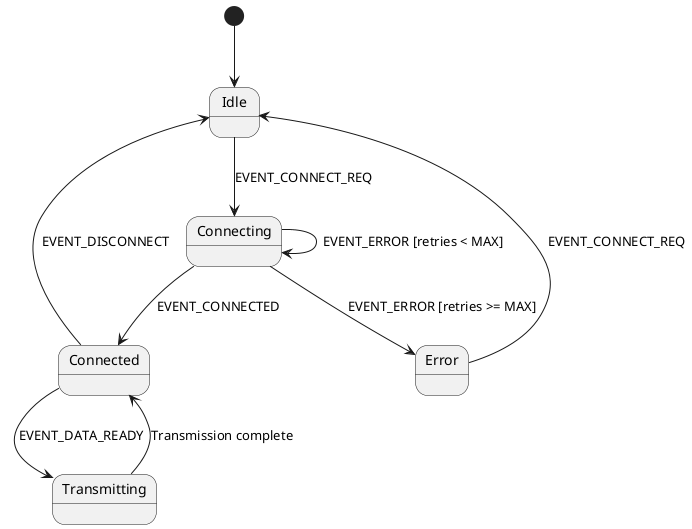

# State Machine Patterns for Embedded Systems

**Professional state machine implementation patterns for embedded firmware**

---

## Overview

State machines are fundamental to embedded systems for managing complex behaviors, protocols, and control logic in a structured, maintainable way. This guide covers industry-proven patterns for implementing finite state machines (FSM) and hierarchical state machines (HSM).

---

## Pattern 1: Switch-Case State Machine

**Use When**: Simple state machines with clear state transitions and no hierarchical structure

### Implementation

```c
typedef enum {
    STATE_IDLE,
    STATE_CONNECTING,
    STATE_CONNECTED,
    STATE_TRANSMITTING,
    STATE_ERROR
} system_state_t;

typedef enum {
    EVENT_CONNECT_REQUEST,
    EVENT_CONNECTED,
    EVENT_DISCONNECT,
    EVENT_DATA_READY,
    EVENT_ERROR,
    EVENT_NONE
} system_event_t;

typedef struct {
    system_state_t current_state;
    uint32_t connection_timeout_ms;
    uint32_t retry_count;
} state_machine_context_t;

static state_machine_context_t s_sm_ctx = {
    .current_state = STATE_IDLE,
    .connection_timeout_ms = 5000,
    .retry_count = 0
};

void state_machine_process(system_event_t event) {
    system_state_t next_state = s_sm_ctx.current_state;

    switch (s_sm_ctx.current_state) {
        case STATE_IDLE:
            if (EVENT_CONNECT_REQUEST == event) {
                /* Entry action for CONNECTING state */
                start_connection();
                s_sm_ctx.retry_count = 0;
                next_state = STATE_CONNECTING;
            }
            break;

        case STATE_CONNECTING:
            if (EVENT_CONNECTED == event) {
                /* Entry action for CONNECTED state */
                initialize_connection();
                next_state = STATE_CONNECTED;
            } else if (EVENT_ERROR == event) {
                s_sm_ctx.retry_count++;
                if (s_sm_ctx.retry_count < MAX_RETRIES) {
                    /* Retry connection */
                    start_connection();
                } else {
                    /* Max retries exceeded */
                    next_state = STATE_ERROR;
                }
            }
            break;

        case STATE_CONNECTED:
            if (EVENT_DATA_READY == event) {
                /* Entry action for TRANSMITTING state */
                start_transmission();
                next_state = STATE_TRANSMITTING;
            } else if (EVENT_DISCONNECT == event) {
                /* Exit action for CONNECTED state */
                cleanup_connection();
                next_state = STATE_IDLE;
            }
            break;

        case STATE_TRANSMITTING:
            /* Transmission complete is checked via different mechanism */
            next_state = STATE_CONNECTED;
            break;

        case STATE_ERROR:
            /* Error recovery logic */
            if (EVENT_CONNECT_REQUEST == event) {
                s_sm_ctx.retry_count = 0;
                next_state = STATE_IDLE;
            }
            break;

        default:
            /* Invalid state */
            next_state = STATE_ERROR;
            break;
    }

    /* State transition logging */
    if (next_state != s_sm_ctx.current_state) {
        log_state_transition(s_sm_ctx.current_state, next_state);
        s_sm_ctx.current_state = next_state;
    }
}
```

### Advantages
- Simple and straightforward
- Easy to understand and debug
- Minimal memory overhead
- Good for small state machines (< 10 states)

### Disadvantages
- No code reuse between states
- Difficult to maintain as complexity grows
- No hierarchical state support

---

## Pattern 2: State Table (Function Pointer Array)

**Use When**: Medium complexity, need better code organization and extensibility

### Implementation

```c
typedef enum {
    STATE_IDLE = 0,
    STATE_CONNECTING,
    STATE_CONNECTED,
    STATE_TRANSMITTING,
    STATE_ERROR,
    STATE_COUNT  /* Must be last */
} state_t;

typedef enum {
    EVENT_CONNECT_REQ = 0,
    EVENT_CONNECTED,
    EVENT_DISCONNECT,
    EVENT_DATA_READY,
    EVENT_ERROR,
    EVENT_COUNT  /* Must be last */
} event_t;

/* State handler function signature */
typedef state_t (*state_handler_t)(event_t event);

/* Forward declarations */
static state_t handle_idle(event_t event);
static state_t handle_connecting(event_t event);
static state_t handle_connected(event_t event);
static state_t handle_transmitting(event_t event);
static state_t handle_error(event_t event);

/* State table: maps states to handler functions */
static const state_handler_t state_table[STATE_COUNT] = {
    [STATE_IDLE]         = handle_idle,
    [STATE_CONNECTING]   = handle_connecting,
    [STATE_CONNECTED]    = handle_connected,
    [STATE_TRANSMITTING] = handle_transmitting,
    [STATE_ERROR]        = handle_error
};

/* State machine context */
typedef struct {
    state_t current_state;
    uint32_t error_count;
} sm_context_t;

static sm_context_t s_context = {
    .current_state = STATE_IDLE,
    .error_count = 0
};

/* Entry/exit actions (optional) */
typedef void (*state_action_t)(void);

static void on_enter_connecting(void) {
    start_connection_timer();
}

static void on_exit_connected(void) {
    cleanup_connection();
}

/* State handler implementations */
static state_t handle_idle(event_t event) {
    state_t next_state = STATE_IDLE;

    switch (event) {
        case EVENT_CONNECT_REQ:
            on_enter_connecting();
            next_state = STATE_CONNECTING;
            break;

        default:
            /* Ignore other events */
            break;
    }

    return next_state;
}

static state_t handle_connecting(event_t event) {
    state_t next_state = STATE_CONNECTING;

    switch (event) {
        case EVENT_CONNECTED:
            next_state = STATE_CONNECTED;
            break;

        case EVENT_ERROR:
            s_context.error_count++;
            if (s_context.error_count < MAX_RETRIES) {
                on_enter_connecting();  /* Retry */
            } else {
                next_state = STATE_ERROR;
            }
            break;

        default:
            break;
    }

    return next_state;
}

static state_t handle_connected(event_t event) {
    state_t next_state = STATE_CONNECTED;

    switch (event) {
        case EVENT_DATA_READY:
            next_state = STATE_TRANSMITTING;
            break;

        case EVENT_DISCONNECT:
            on_exit_connected();
            next_state = STATE_IDLE;
            break;

        case EVENT_ERROR:
            on_exit_connected();
            next_state = STATE_ERROR;
            break;

        default:
            break;
    }

    return next_state;
}

static state_t handle_transmitting(event_t event) {
    /* Implementation */
    return STATE_CONNECTED;
}

static state_t handle_error(event_t event) {
    state_t next_state = STATE_ERROR;

    switch (event) {
        case EVENT_CONNECT_REQ:
            s_context.error_count = 0;
            next_state = STATE_IDLE;
            break;

        default:
            break;
    }

    return next_state;
}

/* Main state machine processor */
void sm_process_event(event_t event) {
    state_t next_state;

    /* Validate current state */
    if (s_context.current_state >= STATE_COUNT) {
        s_context.current_state = STATE_ERROR;
        return;
    }

    /* Call state handler */
    next_state = state_table[s_context.current_state](event);

    /* Handle state transition */
    if (next_state != s_context.current_state) {
        log_transition(s_context.current_state, next_state);
        s_context.current_state = next_state;
    }
}
```

### Advantages
- Better code organization
- Easy to add new states
- Clear separation of state logic
- Supports entry/exit actions

### Disadvantages
- Function pointer overhead (minimal)
- Still no hierarchical state support

---

## Pattern 3: Hierarchical State Machine (HSM)

**Use When**: Complex behaviors with nested states and common event handling

### Implementation

```c
typedef struct state_t state_t;

/* State handler signature */
typedef state_t* (*state_handler_fn)(state_t *state, event_t event);

struct state_t {
    state_handler_fn handler;
    state_t *parent;          /* Parent state for hierarchy */
    const char *name;         /* For debugging */
};

/* Event structure */
typedef struct {
    event_t type;
    void *data;               /* Optional event data */
} event_data_t;

/* State machine instance */
typedef struct {
    state_t *current_state;
    state_t *previous_state;
} hsm_t;

/* Forward declarations */
static state_t* state_top_handler(state_t *state, event_t event);
static state_t* state_operational_handler(state_t *state, event_t event);
static state_t* state_idle_handler(state_t *state, event_t event);
static state_t* state_active_handler(state_t *state, event_t event);

/* State definitions */
static state_t state_top = {
    .handler = state_top_handler,
    .parent = NULL,
    .name = "Top"
};

static state_t state_operational = {
    .handler = state_operational_handler,
    .parent = &state_top,
    .name = "Operational"
};

static state_t state_idle = {
    .handler = state_idle_handler,
    .parent = &state_operational,
    .name = "Idle"
};

static state_t state_active = {
    .handler = state_active_handler,
    .parent = &state_operational,
    .name = "Active"
};

/* HSM instance */
static hsm_t s_hsm = {
    .current_state = &state_idle,
    .previous_state = NULL
};

/* Top-level state (handles common events) */
static state_t* state_top_handler(state_t *state, event_t event) {
    (void)state;

    switch (event) {
        case EVENT_ERROR:
            /* All states inherit error handling */
            handle_error();
            return &state_idle;  /* Reset to idle */

        default:
            /* Unhandled events */
            return NULL;
    }
}

/* Operational state (common for idle and active) */
static state_t* state_operational_handler(state_t *state, event_t event) {
    switch (event) {
        case EVENT_SHUTDOWN:
            /* Common shutdown logic */
            perform_shutdown();
            return &state_idle;

        default:
            /* Delegate to parent */
            return state->parent->handler(state->parent, event);
    }
}

/* Idle state */
static state_t* state_idle_handler(state_t *state, event_t event) {
    switch (event) {
        case EVENT_CONNECT_REQ:
            start_connection();
            return &state_active;

        default:
            /* Delegate to parent */
            return state->parent->handler(state->parent, event);
    }
}

/* Active state */
static state_t* state_active_handler(state_t *state, event_t event) {
    switch (event) {
        case EVENT_DISCONNECT:
            cleanup_connection();
            return &state_idle;

        case EVENT_DATA_READY:
            process_data();
            return NULL;  /* Stay in current state */

        default:
            /* Delegate to parent */
            return state->parent->handler(state->parent, event);
    }
}

/* Process event through HSM */
void hsm_dispatch(event_t event) {
    state_t *next_state = s_hsm.current_state->handler(s_hsm.current_state, event);

    /* State transition */
    if ((next_state != NULL) && (next_state != s_hsm.current_state)) {
        /* Exit current state hierarchy */
        state_t *state = s_hsm.current_state;
        while (state != NULL) {
            /* Call exit actions if defined */
            state = state->parent;
        }

        /* Enter new state hierarchy */
        s_hsm.previous_state = s_hsm.current_state;
        s_hsm.current_state = next_state;

        log_transition(s_hsm.previous_state->name, s_hsm.current_state->name);
    }
}
```

### Advantages
- Supports hierarchical states
- Code reuse through inheritance
- Handles common events at parent level
- Scalable to complex behaviors

### Disadvantages
- More complex implementation
- Slightly higher memory/CPU overhead

---

## Pattern 4: UML State Chart with QP Framework

**Use When**: Very complex systems requiring full UML statechart features (history, orthogonal regions)

### Using Quantum Platform (QP)

```c
#include "qpc.h"

/* State machine signals */
enum {
    CONNECT_SIG = Q_USER_SIG,
    DISCONNECT_SIG,
    DATA_SIG,
    ERROR_SIG,
    MAX_SIG
};

/* Active object (state machine) */
typedef struct {
    QActive super;  /* Inherit QActive */
    uint32_t retry_count;
} MyDevice;

/* Constructor */
void MyDevice_ctor(MyDevice *me) {
    QActive_ctor(&me->super, Q_STATE_CAST(&MyDevice_initial));
    me->retry_count = 0;
}

/* Initial pseudostate */
static QState MyDevice_initial(MyDevice * const me, QEvt const * const e) {
    (void)e;
    return Q_TRAN(&MyDevice_idle);
}

/* Idle state */
static QState MyDevice_idle(MyDevice * const me, QEvt const * const e) {
    QState status;

    switch (e->sig) {
        case Q_ENTRY_SIG:
            /* Entry action */
            status = Q_HANDLED();
            break;

        case CONNECT_SIG:
            status = Q_TRAN(&MyDevice_connecting);
            break;

        default:
            status = Q_SUPER(&QHsm_top);  /* Parent state */
            break;
    }

    return status;
}

/* Connecting state */
static QState MyDevice_connecting(MyDevice * const me, QEvt const * const e) {
    QState status;

    switch (e->sig) {
        case Q_ENTRY_SIG:
            start_connection();
            me->retry_count = 0;
            status = Q_HANDLED();
            break;

        case CONNECT_SUCCESS_SIG:
            status = Q_TRAN(&MyDevice_connected);
            break;

        case ERROR_SIG:
            if (me->retry_count < MAX_RETRIES) {
                me->retry_count++;
                status = Q_TRAN(&MyDevice_connecting);  /* Retry */
            } else {
                status = Q_TRAN(&MyDevice_error);
            }
            break;

        default:
            status = Q_SUPER(&QHsm_top);
            break;
    }

    return status;
}

/* Instance and initialization */
static MyDevice l_device;

void device_init(void) {
    MyDevice_ctor(&l_device);
    QACTIVE_START(&l_device,
                  5U,           /* Priority */
                  event_queue,  /* Event queue */
                  10U,          /* Queue length */
                  NULL, 0U,     /* Stack (not used for simple threads) */
                  NULL);        /* No initialization event */
}
```

---

## Best Practices

### 1. State Transition Logging

```c
void log_state_transition(state_t from, state_t to) {
    #ifdef DEBUG_STATE_MACHINE
    printf("[SM] %s -> %s\n", state_name(from), state_name(to));
    #endif
}

const char* state_name(state_t state) {
    static const char* names[] = {
        "IDLE", "CONNECTING", "CONNECTED", "TRANSMITTING", "ERROR"
    };

    if (state < STATE_COUNT) {
        return names[state];
    }
    return "UNKNOWN";
}
```

### 2. Guard Conditions

```c
static state_t handle_idle(event_t event) {
    state_t next_state = STATE_IDLE;

    switch (event) {
        case EVENT_CONNECT_REQ:
            /* Guard condition */
            if (is_network_available() && battery_level_ok()) {
                next_state = STATE_CONNECTING;
            } else {
                log_error("Preconditions not met for connection");
            }
            break;

        default:
            break;
    }

    return next_state;
}
```

### 3. Timeout Handling

```c
typedef struct {
    state_t state;
    uint32_t entry_timestamp;
    uint32_t timeout_ms;
} timed_state_machine_t;

void sm_tick(timed_state_machine_t *sm) {
    uint32_t elapsed = get_tick_count() - sm->entry_timestamp;

    if (elapsed > sm->timeout_ms) {
        /* Timeout event */
        sm_process_event(sm, EVENT_TIMEOUT);
    }
}
```

### 4. State Persistence

```c
/* Save state to non-volatile memory */
void sm_save_state(state_t state) {
    eeprom_write(STATE_STORAGE_ADDR, &state, sizeof(state));
}

/* Restore state after reset */
state_t sm_restore_state(void) {
    state_t saved_state;
    eeprom_read(STATE_STORAGE_ADDR, &saved_state, sizeof(saved_state));

    if (saved_state >= STATE_COUNT) {
        return STATE_IDLE;  /* Invalid state, reset */
    }

    return saved_state;
}
```

---

## Testing State Machines

### Unit Testing

```c
void test_idle_to_connecting_transition(void) {
    /* Setup */
    sm_reset();
    assert(sm_get_current_state() == STATE_IDLE);

    /* Action */
    sm_process_event(EVENT_CONNECT_REQ);

    /* Verify */
    assert(sm_get_current_state() == STATE_CONNECTING);
    assert(connection_started());
}

void test_retry_logic(void) {
    sm_set_state(STATE_CONNECTING);

    for (int i = 0; i < MAX_RETRIES - 1; i++) {
        sm_process_event(EVENT_ERROR);
        assert(sm_get_current_state() == STATE_CONNECTING);
    }

    /* Final retry should transition to error */
    sm_process_event(EVENT_ERROR);
    assert(sm_get_current_state() == STATE_ERROR);
}
```

---

## Tools and Visualization

### PlantUML State Diagram



---

## References

- "Practical Statecharts in C/C++" by Miro Samek
- UML 2.5 Specification (State Machine Diagrams)
- QP Real-Time Embedded Frameworks
- "Design Patterns for Embedded Systems in C" by Bruce Powel Douglass

---

**Choose the appropriate state machine pattern based on complexity and requirements. Start simple, refactor to more complex patterns as needed.**
