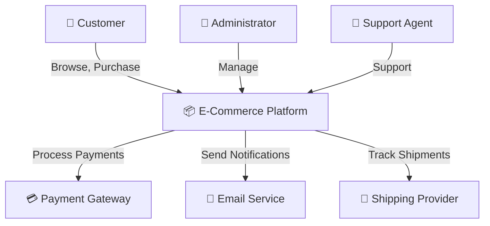

# Creating C4 Diagrams: A Comprehensive Guide

## Overview

The C4 Model is a hierarchical approach to documenting software architecture using four levels of diagrams. It bridges the gap between high-level business context and detailed code implementation, making it ideal for communicating architecture to diverse stakeholders.

**Key Benefits**:
- Progressive detail from business context to code
- Consistent notation across diagrams
- Suitable for different audience levels
- Tools support (draw.io, Structurizr, Mermaid, PlantUML)
- Version control friendly

## C4 Model Hierarchy

### Level 1: System Context Diagram

Shows your system in the center with external systems and users around it.

**Purpose**: Answer "What problem does this system solve?"

**Elements**:
- **System**: The software system you're documenting (single box)
- **Users/Personas**: People using the system
- **External Systems**: Other software systems the system interacts with
- **Relationships**: Interactions between elements

**When to Create**:
- Project kickoff
- Stakeholder communication
- Requirements gathering
- System integration planning

### Level 2: Container Diagram

Zooms into the system to show high-level technology choices and communication patterns.

**Purpose**: Answer "How is the system made up at a high level?"

**Elements**:
- **Containers**: Applications, web apps, databases, microservices
- **Technology Stack**: Programming language, framework, database type
- **Communication**: Protocols (HTTP/REST, gRPC, message queues)
- **Responsibilities**: What each container does

**Container Types**:
- Web Application (React, Vue, Angular)
- Mobile Application (iOS, Android, React Native)
- Server-Side Application (Java, Python, Node.js)
- Database (PostgreSQL, MongoDB, DynamoDB)
- Message Queue (RabbitMQ, Kafka, SQS)
- File Store (S3, GCS, Azure Blob)
- Cache (Redis, Memcached)
- API Gateway/Load Balancer
- Search Index (Elasticsearch, Solr)

**When to Create**:
- Architecture design phase
- Technology selection justification
- Deployment planning
- Team structure alignment (Conway's Law)

### Level 3: Component Diagram

Shows the major structural components within a container.

**Purpose**: Answer "How is the container decomposed into components?"

**Elements**:
- **Components**: Modules, libraries, subsystems, classes, functions
- **Technology**: Technology used within that component
- **Responsibilities**: What each component does
- **Interfaces**: Public APIs and contracts

**Component Examples**:
- Presentation Components (Controllers, Views)
- Business Logic (Services, Managers, Handlers)
- Data Access (Repositories, DAOs, Data Mappers)
- Cross-Cutting Concerns (Logging, Security, Cache)
- Domain Models (Entities, Value Objects)

**When to Create**:
- Detailed design documentation
- Code review preparation
- New team member onboarding
- Major refactoring planning

### Level 4: Code Diagram

The most detailed level, showing class, package, or code structure.

**Purpose**: Answer "How are the components implemented?"

**Note**: This level is optional and often better served by IDE navigation or generated diagrams.

## C4 Diagram Notation

### Standard Elements

```
[System Name]          <- Box with system inside
(Database)             <- Cylinder for databases
(Person/User)          <- Stick figure or icon
[External System]      <- Box for external systems
```

### Relationships

```
System → User          <- Uses/Interacts with
User ← System          <- Provides to
[A] ↔ [B]            <- Bidirectional communication
[A] → [B]: HTTPS      <- Labeled relationship with protocol
```

### Color Conventions

- **Gray**: External systems
- **Blue**: Systems/containers you build
- **Green**: Users/actors
- **Yellow**: Decisions/important notes
- **Red**: Risk/deprecated/legacy

## Step-by-Step C4 Creation Process

### Step 1: Define System Boundaries

**Questions to Answer**:
1. What is the scope of your system?
2. What are the clear boundaries?
3. What's in scope, what's out?
4. What are the external dependencies?

**Example Definition**:
```
System: E-Commerce Platform
Scope: Shopping cart, checkout, payment, order management
Out of Scope: Email marketing, analytics, accounting
External Dependencies: Payment Gateway, Email Service, Shipping Provider
```

### Step 2: Identify Users and External Systems

**For Each User Type**:
- Name and role
- Primary use cases
- How they interact with system
- Access frequency

**For Each External System**:
- Name and purpose
- How it's used
- Communication protocol
- Dependency type (required, optional)

### Step 3: Create Context Diagram

**Process**:

1. **Place your system in center**
   ```
   System: E-Commerce Platform
   ┌─────────────────────────┐
   │  E-Commerce Platform    │
   └─────────────────────────┘
   ```

2. **Add users and personas**
   ```
       👤 Customer               👤 Admin

   ┌─────────────────────────┐
   │  E-Commerce Platform    │
   └─────────────────────────┘

       👤 Support Agent
   ```

3. **Add external systems**
   ```
       👤 Customer               👤 Admin
           ↓                         ↓
   ┌─────────────────────────┐
   │  E-Commerce Platform    │
   └─────────────────────────┘
           ↓         ↓         ↓
     Payment      Email      Shipping
     Gateway      Service    Provider
   ```

4. **Add relationships with descriptions**
   ```
   Customer → [System]: Browse products, add to cart, checkout (HTTPS)
   Admin → [System]: Manage inventory, view orders, process refunds (HTTPS)
   Support → [System]: Update order status, view customer info (HTTPS)
   [System] → Payment: Process payments (HTTPS/REST)
   [System] → Email: Send confirmation, notification (SMTP)
   [System] → Shipping: Create labels, track shipments (HTTPS/REST)
   ```

### Step 4: Create Container Diagram

**Process**:

1. **List all containers**
   - Web Application (React)
   - Mobile Application (React Native)
   - Backend API (Java Spring Boot)
   - PostgreSQL Database
   - Redis Cache
   - File Storage (S3)

2. **Show communication between containers**
   ```
   [Web App] ↔ [API]: REST/HTTPS
   [Mobile] ↔ [API]: REST/HTTPS
   [API] ↔ [Database]: SQL
   [API] ↔ [Cache]: TCP
   [API] → [S3]: HTTPS
   ```

3. **Add technology specifications**
   ```
   [Web Application - React]
   Single-page application for customer interactions

   [Backend API - Java Spring Boot]
   Provides REST API for all business logic

   [PostgreSQL Database]
   Primary data store for orders, products, customers

   [Redis Cache]
   Session storage and frequently accessed data

   [S3 File Storage]
   Product images, invoices, receipts
   ```

4. **Assign responsibilities to each container**
   - Web App: User interface, client-side validation
   - API: Business logic, authentication, data access
   - Database: Data persistence
   - Cache: Session management, performance optimization
   - Storage: File management

### Step 5: Create Component Diagram

**For Each Container, Identify Major Components**:

Example for Backend API Container:

1. **Controller Layer**
   - ProductController
   - OrderController
   - UserController
   - PaymentController

2. **Service Layer**
   - ProductService
   - OrderService
   - PaymentService
   - UserService

3. **Repository Layer**
   - ProductRepository
   - OrderRepository
   - UserRepository

4. **Utility/Cross-cutting**
   - AuthenticationFilter
   - ExceptionHandler
   - CacheManager
   - LoggingAspect

**Show Components and Relationships**:
```
[Controller Layer]
  ├─ ProductController → [ProductService]
  ├─ OrderController → [OrderService]
  └─ UserController → [UserService]

[Service Layer]
  ├─ ProductService → [ProductRepository]
  ├─ OrderService → [OrderRepository] + [PaymentService]
  └─ PaymentService → External Payment Gateway

[Cross-cutting Concerns]
  ├─ AuthenticationFilter → Controllers
  ├─ ExceptionHandler → All Layers
  └─ CacheManager → Service Layer
```

## C4 Diagram Best Practices

### Do's

✓ **Keep it simple**: Don't try to show everything. Progressive disclosure.

✓ **Use consistent notation**: Follow C4 conventions throughout all diagrams.

✓ **Label relationships clearly**: Show protocols, data flow direction, frequency.

✓ **Provide context**: Add descriptions of what each element does.

✓ **Use color meaningfully**: Establish and follow color conventions.

✓ **One diagram per level**: Don't mix levels in single diagram.

✓ **Add legends**: Explain symbols, colors, notation.

✓ **Version control**: Keep diagrams in source control with code.

✓ **Update regularly**: Keep diagrams synchronized with actual architecture.

### Don'ts

✗ **Don't show everything at once**: That's what multiple levels are for.

✗ **Don't mix abstraction levels**: Each diagram has specific scope.

✗ **Don't use unclear labels**: "System A talks to System B" is too vague.

✗ **Don't make diagrams too large**: Can't fit on screen, hard to print.

✗ **Don't forget the legend**: Symbol meanings must be clear.

✗ **Don't create unnecessary levels**: Level 4 (code) is often unnecessary.

✗ **Don't make it artistic**: Function over form. Keep it clean and readable.

## Common Pitfalls and Solutions

### Pitfall 1: Unclear Boundaries
**Problem**: Where does responsibility end?
**Solution**: Define container boundaries explicitly. Use responsibility descriptions.

### Pitfall 2: Over-complexity
**Problem**: Trying to show too much detail.
**Solution**: Use hierarchical approach. Don't skip levels. Provide multiple views.

### Pitfall 3: Missing Technology Stack
**Problem**: Context is lost about what technologies are used.
**Solution**: Always specify technology in containers and components.

### Pitfall 4: Stale Diagrams
**Problem**: Diagrams diverge from reality.
**Solution**: Keep diagrams close to code. Review quarterly. Update with major changes.

### Pitfall 5: No Relationships Documentation
**Problem**: Unclear how elements communicate.
**Solution**: Label all arrows with protocols, methods, data types.

## Tools and Templates

### Tool Recommendations

**draw.io**
- Free, web-based
- Good C4 libraries
- Export to multiple formats
- Version control friendly (XML)

**Structurizr**
- Dedicated C4 tool
- Code-based diagrams
- Automatic layout
- Multi-user collaboration

**Mermaid**
- Text-based, version control friendly
- Integrates with Markdown
- Growing C4 support
- CI/CD integration

**PlantUML**
- Text-based, excellent for documentation
- C4 extension available
- Integrates well with documentation tools
- Ideal for automated generation

### Sample C4 Diagram in Mermaid



## Checklist for C4 Diagrams

- [ ] System boundary clearly defined
- [ ] All user types identified
- [ ] All external dependencies shown
- [ ] Communication protocols labeled
- [ ] Technology stack specified
- [ ] Component responsibilities clear
- [ ] Color convention defined and followed
- [ ] Legend provided
- [ ] Last update date included
- [ ] Stored in version control
- [ ] Reviewed by team
- [ ] Maintenance schedule established

## Next Steps

1. **Start with Context Diagram**: Get stakeholder agreement on scope
2. **Create Container Diagram**: Align on technology choices
3. **Detailed Components**: Plan implementation
4. **Keep Updated**: Establish review cycle
5. **Link to Code**: Show connection between diagram and implementation

---

**Resources**:
- C4 Model Official Site: https://c4model.com
- Structurizr Documentation
- PlantUML C4 Diagrams Extension
- draw.io C4 Shape Library
