# Creating Diagrams as Code: Mermaid and PlantUML Guide

## Why Diagrams as Code?

### Benefits

**Version Control Friendly**
- Text-based format (git diff readable)
- No binary files (easier merging)
- Review changes in pull requests
- Full change history

**Collaboration Enabled**
- Multiple people can edit same diagram
- No tool lock-in
- Works with any editor
- Easy to comment and discuss

**Documentation Integration**
- Keep diagrams in same repo as code
- Embed in Markdown documents
- Update docs with code changes
- Single source of truth

**Automation Possible**
- Generate from configuration
- CI/CD integration
- Programmatic diagram creation
- Batch updates

**Consistent Style**
- Team standards enforced
- No design variations
- Automated formatting
- Professional appearance

## Introduction to Mermaid

### What is Mermaid?

Mermaid is a JavaScript-based diagramming and charting tool that uses a simple, Markdown-inspired syntax to create and modify diagrams dynamically.

### Advantages

✓ **Easy syntax** - Minimal learning curve
✓ **No installation** - Runs in browser
✓ **GitHub integration** - Renders in README files
✓ **Modern diagrams** - Beautiful default styling
✓ **Active community** - Regularly updated
✓ **Free and open source**

### Disadvantages

✗ Layout control limited
✗ Large diagrams can be unwieldy
✗ C4 diagram support still developing
✗ Limited styling customization

### Getting Started

**Online Editor**: https://mermaid.live

**In Markdown**:
```markdown
\`\`\`mermaid
graph TD
    A[Start] --> B{Decision}
    B -->|Yes| C[Do Something]
    B -->|No| D[Do Else]
\`\`\`
```

**GitHub Integration**:
GitHub automatically renders Mermaid diagrams in .md files

## Mermaid Diagram Types

### 1. Flowcharts (graph)

Most basic diagram type. Shows process flow and decision logic.

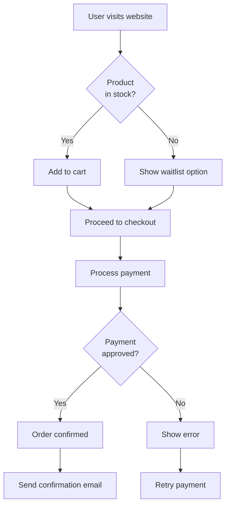

**Syntax**:
```markdown
graph TD
    A[Node label] --> B{Decision node}
    B -->|Yes| C[Next node]
    B -->|No| D[Alternative]

    // Different node types:
    A[Rounded rectangle]
    B(Parentheses)
    C{Diamond}
    D[[Double bracket]]
    E>Asymmetric]
    F@{ Circle }
```

**Use Cases**:
- Business process flows
- User workflows
- Decision trees
- System processes

### 2. Sequence Diagrams

Shows interaction between actors over time.

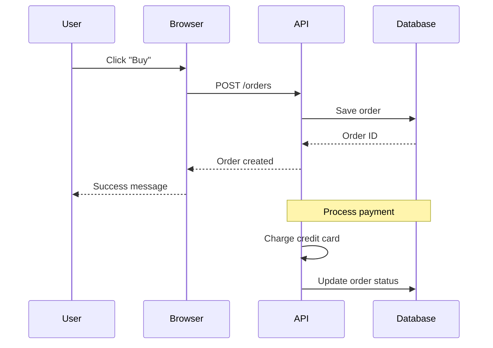

**Syntax**:
```markdown
sequenceDiagram
    participant A
    participant B

    A ->> B: Synchronous call
    B -->> A: Dashed response
    A -x B: Async call

    Note over A,B: Important note
    rect rgb(200, 150, 255)
        Note over A: Critical section
    end
```

**Use Cases**:
- API interaction flows
- User-system interactions
- Message sequences
- Authentication flows

### 3. Class Diagrams

Shows object-oriented structure and relationships.

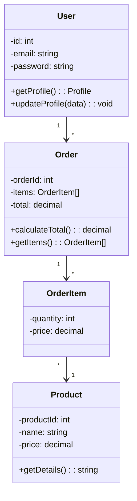

**Syntax**:
```markdown
classDiagram
    class ClassName {
        -privateField: type
        +publicMethod(): returnType
        #protectedField: type
    }

    ClassName1 --> ClassName2: inherits
    Class1 "1" --> "*" Class2: has many
```

**Use Cases**:
- Object-oriented design
- API data models
- Database schema (entities)
- Class hierarchies

### 4. State Diagrams

Shows states and transitions.

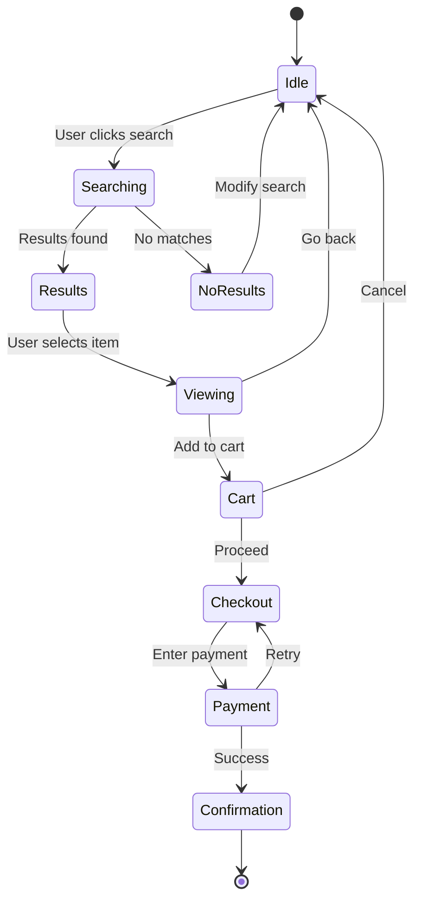

**Syntax**:
```markdown
stateDiagram-v2
    [*] --> State1
    State1 --> State2: Transition label
    State2 --> [*]

    State3 --> State3: Self-transition
```

**Use Cases**:
- Order processing flow
- User authentication states
- System states and transitions
- State machines

### 5. Entity Relationship Diagrams (ERD)

Shows database relationships.

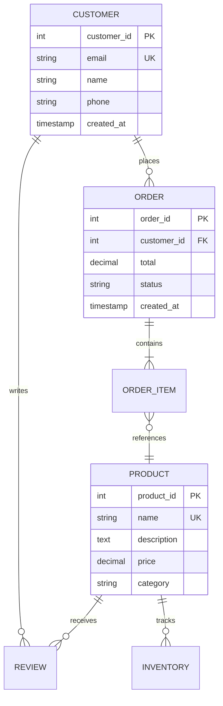

**Syntax**:
```markdown
erDiagram
    ENTITY1 ||--o{ ENTITY2: relationship

    ENTITY {
        type name PK "Primary Key"
        type field UK "Unique Key"
        type field FK "Foreign Key"
    }
```

**Relationships**:
- `|o` - Zero or one
- `||` - Exactly one
- `o{` - Zero or many
- `|{` - One or many

**Use Cases**:
- Database schemas
- Data models
- System data relationships

### 6. Gantt Charts

Shows project timeline and dependencies.

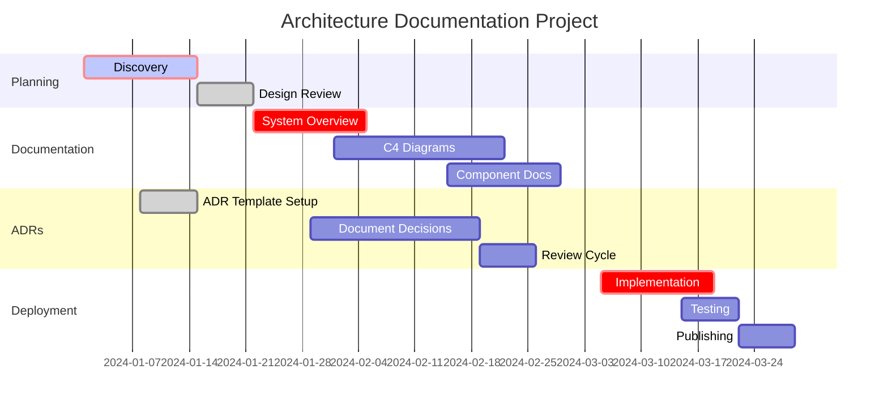

**Use Cases**:
- Project timelines
- Documentation roadmaps
- Release planning
- Milestone tracking

### 7. Git Graphs (for commit history)

Shows git workflow.

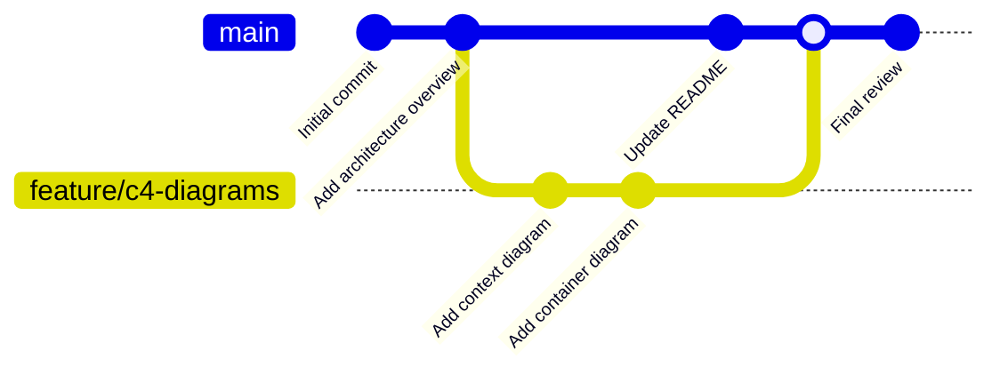

**Use Cases**:
- Git workflow documentation
- Branching strategy visualization
- Release process documentation

## Introduction to PlantUML

### What is PlantUML?

PlantUML is a component that allows you to write UML diagrams with a simple and intuitive language, supporting a wide range of diagram types.

### Advantages

✓ **Mature technology** - Stable, widely used
✓ **Comprehensive** - Many diagram types
✓ **Powerful** - Fine-grained control
✓ **C4 support** - Excellent for architecture
✓ **Integration** - Works with many tools
✓ **Styling** - Customizable appearance

### Disadvantages

✗ Requires installation/server
✗ Steeper learning curve
✗ More verbose syntax
✗ Less GitHub integration

### Getting Started

**Online Editor**: https://www.plantuml.com/plantuml/uml/

**Installation**:
```bash
# Using Homebrew (macOS)
brew install plantuml

# Using apt (Ubuntu)
sudo apt install plantuml

# Using pip
pip install plantuml
```

## PlantUML Diagram Types

### 1. Component Diagrams

Shows components and their relationships.

```plantuml
@startuml
!include https://raw.githubusercontent.com/RicardoNiepel/C4-PlantUML/master/C4_Component.puml

package "Order Service" #DDDDDD {
    component [OrderController] as OC #AAFFAA
    component [OrderService] as OS #AAFFAA
    component [OrderRepository] as OR #AAFFAA
    component [PaymentClient] as PC #FFAAAA

    OC --> OS: Calls
    OS --> OR: Queries
    OS --> PC: Calls
}

package "External Systems" #EEEEEE {
    component [Payment Gateway] as PG #FFAAAA
}

OR --> DB: Writes to
PC --> PG: Calls
```

**Use Cases**:
- Microservice architecture
- Component relationships
- Technology stack visualization

### 2. Deployment Diagrams

Shows physical deployment structure.

```plantuml
@startuml
!include https://raw.githubusercontent.com/RicardoNiepel/C4-PlantUML/master/C4_Deployment.puml

Deployment_Node(AWS, "Amazon Web Services", "AWS") {
    Deployment_Node(ALB, "Load Balancer", "ALB") {
    }
    Deployment_Node(K8S, "Kubernetes Cluster", "EKS") {
        Deployment_Node(NS1, "API Namespace", "K8s Namespace") {
            Container(API1, "API Instance 1", "Java")
            Container(API2, "API Instance 2", "Java")
        }
    }
    Deployment_Node(RDS, "Database", "RDS") {
        ContainerDb(DB, "PostgreSQL", "Database")
    }
    Deployment_Node(ElastiCache, "Cache", "ElastiCache") {
        Container(REDIS, "Redis", "Cache")
    }
}

Rel(ALB, API1, "HTTP")
Rel(ALB, API2, "HTTP")
Rel(API1, DB, "SQL")
Rel(API2, DB, "SQL")
Rel(API1, REDIS, "TCP")
Rel(API2, REDIS, "TCP")
@enduml
```

### 3. Sequence Diagrams

Similar to Mermaid but with more control.

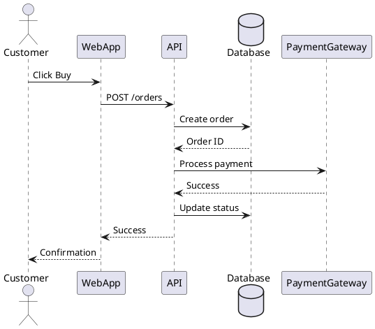

### 4. Use Case Diagrams

Shows system functionality from user perspective.

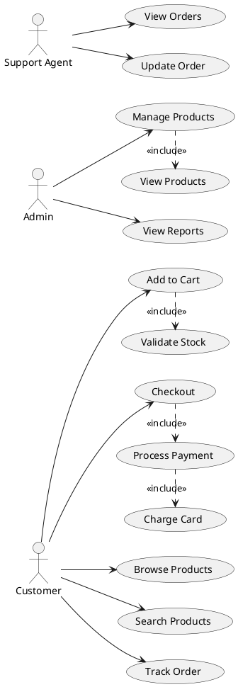

### 5. State Diagrams

Shows state transitions with more control.

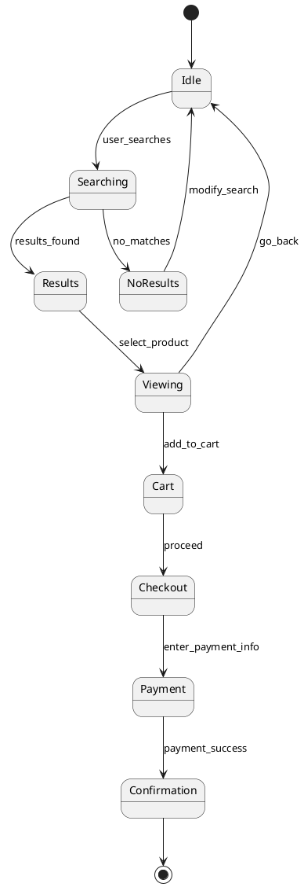

## C4 Diagrams with PlantUML

PlantUML has excellent C4 support with the C4 library.

### C4 Context Diagram

```plantuml
@startuml C4 System Context
!include https://raw.githubusercontent.com/RicardoNiepel/C4-PlantUML/master/C4_Context.puml

SHOW_PERSON_OUTLINE()

Person(customer, "Customer", "A customer using the e-commerce platform")
Person(admin, "Admin", "Internal administrator")

System(ecommerce, "E-Commerce Platform", "Allows customers to browse and purchase products")

System_Ext(paymentgateway, "Payment Gateway", "Processes credit card payments")
System_Ext(emailservice, "Email Service", "Sends emails")
System_Ext(shippingapi, "Shipping API", "Manages shipments")

Rel(customer, ecommerce, "Uses")
Rel(admin, ecommerce, "Manages")
Rel(ecommerce, paymentgateway, "Uses", "HTTPS/REST")
Rel(ecommerce, emailservice, "Uses", "HTTPS/REST")
Rel(ecommerce, shippingapi, "Uses", "HTTPS/REST")
@enduml
```

### C4 Container Diagram

```plantuml
@startuml C4 Container
!include https://raw.githubusercontent.com/RicardoNiepel/C4-PlantUML/master/C4_Container.puml

SHOW_PERSON_OUTLINE()

Person(customer, "Customer", "")

System_Boundary(ecommerce, "E-Commerce Platform") {
    Container(webapp, "Web Application", "React, TypeScript", "Provides e-commerce UI")
    Container(api, "API", "Java Spring Boot", "Provides REST API")
    ContainerDb(db, "Database", "PostgreSQL", "Stores user, order, product data")
    Container(cache, "Cache", "Redis", "Stores sessions and frequently accessed data")
}

System_Ext(paymentgateway, "Payment Gateway", "Processes payments")

Rel(customer, webapp, "Uses", "HTTPS")
Rel(webapp, api, "Calls", "REST/HTTPS")
Rel(api, db, "Reads/Writes", "SQL")
Rel(api, cache, "Reads/Writes", "TCP")
Rel(api, paymentgateway, "Calls", "HTTPS/REST")
@enduml
```

### C4 Component Diagram

```plantuml
@startuml C4 Component
!include https://raw.githubusercontent.com/RicardoNiepel/C4-PlantUML/master/C4_Component.puml

Container_Boundary(api, "API Container") {
    Component(orderctrl, "OrderController", "Spring Controller", "")
    Component(orderservice, "OrderService", "Spring Service", "")
    Component(ordererpo, "OrderRepository", "Spring Data", "")
    Component(productservice, "ProductService", "Spring Service", "")
    Component(paymentclient, "PaymentClient", "HTTP Client", "")
}

ContainerDb(db, "Database", "PostgreSQL", "")
System_Ext(paymentgw, "Payment Gateway", "")

Rel(orderctrl, orderservice, "Uses")
Rel(orderservice, ordererpo, "Uses")
Rel(orderservice, productservice, "Uses")
Rel(orderservice, paymentclient, "Uses")
Rel(ordererpo, db, "Reads/Writes")
Rel(paymentclient, paymentgw, "Uses")
@enduml
```

## Best Practices for Diagrams as Code

### Practice 1: Keep Diagrams Simple

Aim for clarity over completeness. Use multiple diagrams to show different aspects.

**Good**:
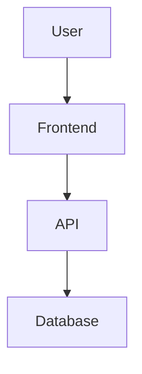

**Too Complex**:
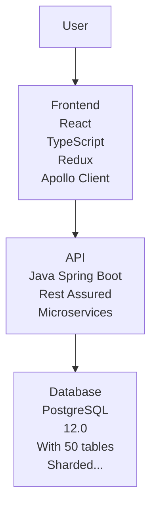

### Practice 2: Use Consistent Styling

Define and follow a style guide.

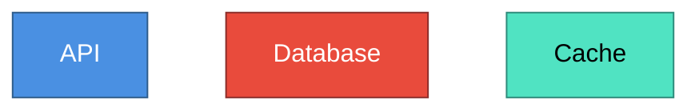

### Practice 3: Label Relationships Clearly

Include protocol, frequency, and data type in labels.

**Good**:
```mermaid
A -->|HTTP POST<br/>user data| B
```

**Unclear**:
```mermaid
A --> B
```

### Practice 4: Version Diagrams with Code

Keep diagrams in source control with code.

```
project/
├── docs/
│   ├── diagrams/
│   │   ├── system-context.mmd
│   │   ├── container-architecture.mmd
│   │   └── component-order-service.mmd
├── src/
```

### Practice 5: Generate from Configuration

Automate diagram generation where possible.

```python
# Generate architecture diagrams from system config
diagrams = load_architecture_config('architecture.yml')
for diagram in diagrams:
    generate_mermaid_diagram(diagram)
    generate_plantuml_diagram(diagram)
```

## Tool Comparison: Mermaid vs PlantUML

| Aspect | Mermaid | PlantUML |
|--------|---------|----------|
| **Learning Curve** | Easy | Moderate |
| **GitHub Integration** | Native support | Requires plugins |
| **Diagram Types** | 7+ types | 15+ types |
| **C4 Support** | Basic | Excellent |
| **Installation** | None (web-based) | Required |
| **Customization** | Limited | Extensive |
| **Performance** | Fast | Variable |
| **Community** | Growing | Large |
| **Best For** | Quick diagrams, documentation | Professional architecture docs |

## Integration with Documentation

### Mermaid in Markdown

```markdown
## System Architecture

\`\`\`mermaid
graph TD
    A[Frontend] --> B[API]
    B --> C[Database]
\`\`\`
```

### PlantUML in Markdown

Using image references:

```markdown
## System Architecture


Generated from: diagrams/system-architecture.puml
```

### In Documentation Tools

**Confluence**: Mermaid plugin available
**GitHub Pages**: Native Mermaid support
**GitLab**: Native Mermaid and PlantUML support
**Notion**: Limited support (use images)

## Creating Diagrams as Code Checklist

- [ ] Diagram type chosen appropriate for content
- [ ] Clear, descriptive labels on all elements
- [ ] All relationships labeled with protocols/methods
- [ ] Consistent naming conventions used
- [ ] Color-coding follows standards
- [ ] Diagram fits on single screen
- [ ] Legend provided if needed
- [ ] Version controlled with code
- [ ] Tested to ensure syntax is correct
- [ ] Related to documented architecture
- [ ] Last update date tracked
- [ ] Reviewed by team
- [ ] Accessibility considered (color-blind friendly)

## Resources

**Mermaid**:
- Official: https://mermaid.js.org
- Live Editor: https://mermaid.live
- Gallery: https://mermaid.js.org/ecosystem/integrations.html

**PlantUML**:
- Official: https://www.plantuml.com
- Online Editor: https://www.plantuml.com/plantuml/uml/
- C4 Extension: https://github.com/RicardoNiepel/C4-PlantUML

**Tools**:
- VS Code Extensions: Markdown Preview Mermaid Support
- JetBrains Plugins: Mermaid and PlantUML support
- GitLab CI: Built-in rendering
