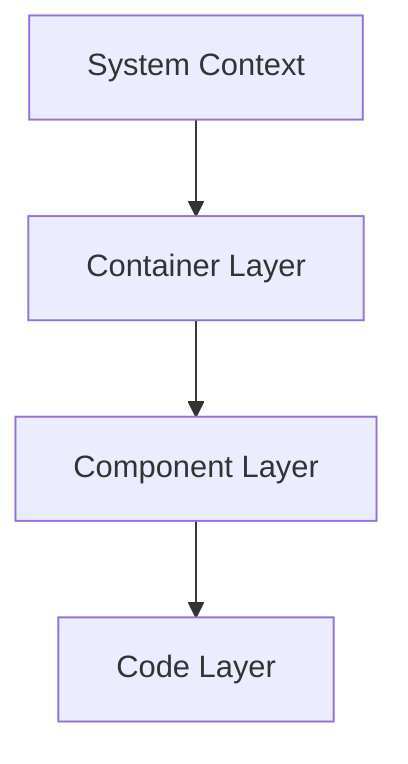
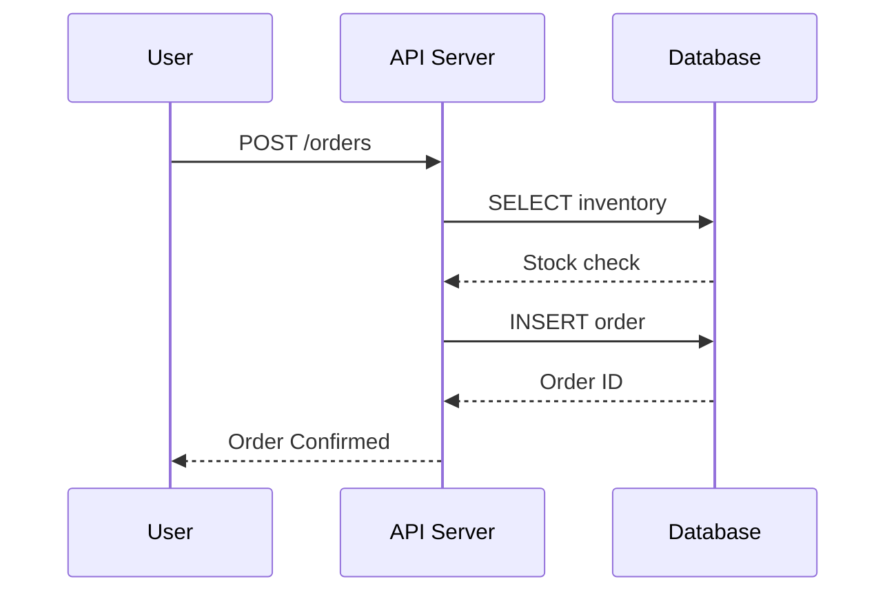
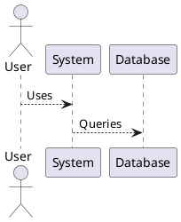
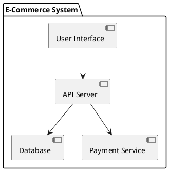

# Diagramming Tools Comparison for Architecture Documentation

## Overview

Choosing the right diagramming tool impacts documentation quality, maintainability, and team adoption. This guide compares popular tools used for architecture documentation.

---

## Tool Comparison Matrix

| Tool | Cost | Learning Curve | Collaboration | Export | Version Control | Specialization |
|------|------|---|---|---|---|---|
| **Draw.io/Diagrams.net** | Free | Low | Good | Excellent | Good (XML) | General |
| **Mermaid** | Free | Low | Via Git | Good | Excellent | Code-based |
| **PlantUML** | Free | Medium | Via Git | Good | Excellent | UML/Code-based |
| **Structurizr** | Paid | Medium | Excellent | Good | Good | C4 Model |
| **Lucidchart** | Paid | Low | Excellent | Excellent | Limited | General |
| **C4-PlantUML** | Free | Medium | Via Git | Good | Excellent | C4 Model |
| **Excalidraw** | Free | Very Low | Good | Excellent | Good | Whiteboard style |
| **ArchiMate** | Free | High | Limited | Good | Poor | Enterprise Architecture |

---

## 1. Draw.io (Diagrams.net)

### Overview
Web-based diagramming tool with extensive template library and intuitive UI.

### Key Features
- **Free**: Completely free version
- **Web-based**: No installation needed
- **Templates**: 100+ architecture templates included
- **Export**: SVG, PNG, PDF, GIF, VSDX
- **Collaboration**: Real-time collaboration (paid)
- **Desktop**: Standalone desktop app available
- **Data**: Self-hosted or cloud storage options

### Pros
✓ Very intuitive interface (low learning curve)
✓ Excellent template library
✓ Multiple storage options (local, Google Drive, OneDrive)
✓ Rich shape library
✓ Good zoom and pan capabilities
✓ Keyboard shortcuts
✓ Free version is fully featured

### Cons
✗ Can feel cluttered with so many options
✗ Limited real-time collaboration (free version)
✗ XML format isn't as developer-friendly
✗ Not ideal for version control (binary-like format)
✗ Performance can degrade with complex diagrams

### Best For
- Teams wanting quick, visual diagram creation
- Projects needing diverse diagram types
- Organizations preferring UI-based tools
- Beginners to architecture documentation

### Example Use Case
```
Good for: Creating C4 system context diagrams,
deployment architecture, use case diagrams

Not ideal for: CI/CD pipelines,
documentation-as-code approaches
```

### Pricing
- **Free**: Basic features, cloud storage (limited)
- **Pro**: $9.99/month per user (real-time collab, export to more formats)
- **Desktop**: Free standalone app

### Getting Started
```
1. Go to diagrams.net
2. Create new diagram
3. Select template category (C4, AWS, etc.)
4. Drag shapes from library
5. Connect with arrows
6. Export as needed
```

---

## 2. Mermaid

### Overview
JavaScript-based diagramming library that renders markdown-like syntax to diagrams.

### Key Features
- **Code-based**: Plain text syntax
- **Integrated**: Works in markdown, GitHub, GitLab
- **Diagrams supported**:
  - Flowchart
  - Sequence diagram
  - Class diagram
  - State diagram
  - ER diagram
  - User journey
  - Git graph
- **Rendering**: Client-side rendering
- **Export**: PNG, SVG, PDF

### Syntax Example


### Pros
✓ Plain text = excellent version control
✓ Easy to review in Git diffs
✓ Works directly in Markdown files
✓ Embedded in GitHub, GitLab, Notion
✓ Free and open source
✓ Fast rendering
✓ No UI learning curve (for developers)
✓ Good for documentation-as-code

### Cons
✗ Steep learning curve for non-developers
✗ Limited styling and customization
✗ Rendering can be inconsistent
✗ Less control over exact positioning
✗ Limited export options
✗ Not suitable for complex diagrams
✗ Browser support variations

### Best For
- Development teams comfortable with code
- Documentation-as-code workflows
- Version control integration
- CI/CD pipeline visualization
- Quick iterations in markdown files

### Example


### Pricing
- **Free**: Open source, unlimited usage

### Getting Started
```
1. Add mermaid markdown code block
2. Write diagram syntax
3. Preview renders automatically
4. Export from browser if needed
```

---

## 3. PlantUML

### Overview
Diagram-as-code tool with focus on UML diagrams and ASCII art rendering.

### Key Features
- **Code-based**: Text-based UML notation
- **Diagram types**:
  - Use case
  - Class diagram
  - Sequence
  - State
  - Component
  - Deployment
  - ER (custom)
- **Servers**: Cloud server or self-hosted
- **Integration**: IDE plugins available
- **Export**: SVG, PNG, ASCII art

### Syntax Example


### Pros
✓ Code-as-documentation
✓ Excellent for UML diagrams
✓ Powerful scripting capabilities
✓ IDE plugin support
✓ Free and open source
✓ Self-hostable
✓ Good revision control
✓ Professional quality output

### Cons
✗ Steep learning curve (UML knowledge required)
✗ Not intuitive for non-technical users
✗ Layout control is limited
✗ Complex syntax for simple diagrams
✗ Compilation-based (not instant feedback)
✗ Harder to debug diagrams

### Best For
- Enterprise architecture teams
- UML-heavy documentation
- Development teams with IDE integration
- Code generation workflows
- Self-hosting requirements

### Example


### Pricing
- **Free**: Open source, cloud server available
- **Enterprise**: Self-hosted deployment

### Getting Started
```
1. Install PlantUML or use online editor
2. Create .puml file
3. Write UML syntax
4. Generate diagram
5. Export or embed
```

---

## 4. Structurizr

### Overview
Dedicated tool for architecture documentation using C4 Model and DSL.

### Key Features
- **C4 Model**: Built specifically for C4
- **DSL**: Domain-specific language for architecture
- **Workspace**: Manages diagrams, documentation, decisions
- **Visualization**: Multiple views from single source
- **Collaboration**: Team workspace
- **Export**: Various formats including Mermaid

### DSL Example
```c4
Person customer "Customer" {
    Description "A customer"
}

System ecommerce "E-Commerce" {
    Description "Online retail platform"
}

Relationship customer ecommerce "Uses"
```

### Pros
✓ Dedicated C4 support
✓ Single source of truth for architecture
✓ Multiple diagram views
✓ Strong collaboration features
✓ Beautiful visualization
✓ Decision documentation integrated
✓ Export to other tools
✓ API for integration

### Cons
✗ Paid service (free tier limited)
✗ Moderate learning curve (DSL)
✗ Vendor lock-in (export options limited)
✗ Requires account/online access
✗ Not ideal for simple diagrams

### Best For
- Organizations using C4 Model
- Large-scale architecture documentation
- Teams needing collaboration
- Enterprise documentation
- Architecture as code approach

### Pricing
- **Free tier**: Workspace with limitations
- **Team**: $50/month per workspace
- **Enterprise**: Custom pricing

### Example Workspace
```
Workspace
├─ Context Diagram
├─ Container Diagram
├─ Component Diagrams (per container)
├─ Deployment Diagram
├─ Architecture Decision Log
└─ Styles/Branding
```

---

## 5. Lucidchart

### Overview
Enterprise diagramming platform with broad template library and strong collaboration.

### Key Features
- **Templates**: Extensive library (AWS, Azure, GCP)
- **Collaboration**: Real-time, robust
- **Sharing**: Advanced permission controls
- **Integration**: Slack, Teams, Google Workspace
- **Mobile**: Native iOS/Android apps
- **Export**: All formats
- **Design**: Professional appearance

### Pros
✓ Very polished user interface
✓ Excellent real-time collaboration
✓ Advanced permission management
✓ AWS/cloud architecture templates
✓ Responsive and fast
✓ Great for presentations
✓ Mobile apps available
✓ Good customer support

### Cons
✗ Expensive compared to alternatives
✗ Not ideal for version control
✗ Overkill for simple diagrams
✗ Learning curve for complex features
✗ Binary format for storage
✗ Requires account (no true offline)

### Best For
- Enterprise teams with budget
- Organizations needing strong collaboration
- Presentable, professional diagrams
- Teams without strong DevOps culture
- Cloud architecture documentation

### Pricing
- **Free tier**: Basic features
- **Team**: $10-25/user/month
- **Enterprise**: Custom pricing

### Use Cases
```
Perfect for: Executive presentations,
cloud architecture, deployment plans

Not ideal for: Quick iterations,
version control in Git
```

---

## 6. C4-PlantUML

### Overview
Open source implementation of C4 Model using PlantUML.

### Key Features
- **Free and open source**
- **C4-specific**: All four levels supported
- **PlantUML based**: Code as documentation
- **Styling**: Professional C4 notation
- **Extensible**: Define custom elements

### Syntax Example
```plantuml
@startuml C4 System Context

!include https://raw.githubusercontent.com/.../C4/C4_Context.puml

Person(customer, "Customer", "A customer")
System(ecommerce, "E-Commerce", "Online retail")
System(payment, "Payment Gateway", "Processes payments")

Rel(customer, ecommerce, "Uses")
Rel(ecommerce, payment, "Processes payments")

@enduml
```

### Pros
✓ Free and open source
✓ Dedicated C4 support
✓ Version control friendly
✓ Professional output
✓ Integrates with PlantUML ecosystem
✓ Customizable
✓ No vendor lock-in

### Cons
✗ PlantUML learning required
✗ Steeper setup than GUI tools
✗ Limited styling compared to Structurizr
✗ Manual layout management

### Best For
- Teams wanting C4 + code control
- Organizations avoiding SaaS
- PlantUML already in use
- Architecture as code approach

### Pricing
- **Free**: Completely open source

---

## 7. Excalidraw

### Overview
Whiteboard-style drawing tool with hand-drawn aesthetic and collaborative features.

### Key Features
- **Whiteboard style**: Hand-drawn appearance
- **Real-time collab**: Built-in collaboration
- **Web-based**: No installation
- **Libraries**: User-created libraries
- **Export**: SVG, PNG
- **ASCII art**: Export to ASCII
- **Self-hosted**: Option available

### Pros
✓ Very intuitive (whiteboard style)
✓ Free and open source
✓ Real-time collaboration
✓ Fun, approachable aesthetic
✓ Fast to create
✓ Great for brainstorming
✓ Self-hostable
✓ Keyboard shortcuts

### Cons
✗ Less formal appearance (not for all audiences)
✗ Limited shape library
✗ Not ideal for complex diagrams
✗ Limited styling
✗ Better for sketches than finalized docs

### Best For
- Quick sketches and brainstorming
- Informal documentation
- Team workshops
- Beginners (lowest barrier)
- Collaborative design sessions

### Pricing
- **Free**: Unlimited usage

---

## 8. ArchiMate

### Overview
ISO/IEC 42010 standard notation for enterprise architecture.

### Key Features
- **Standard notation**: ISO-based
- **Viewpoints**: Multiple perspectives
- **Layers**: Business, Application, Technology
- **Tools**: Various implementations available
- **Integration**: Maps to other frameworks

### Pros
✓ International standard
✓ Comprehensive approach
✓ Enterprise adoption
✓ Well-defined vocabulary

### Cons
✗ Steep learning curve
✗ Overkill for small systems
✗ Limited tool support
✗ Not intuitive for non-architects
✗ Verbose notation

### Best For
- Large enterprises (Fortune 500)
- Regulatory compliance needs
- Complex multi-system landscapes
- TOGAF implementations

### Pricing
- **Free**: Open standard
- **Tools**: Various ($500-10,000+)

---

## Decision Guide: Choosing the Right Tool

### Ask These Questions

**1. Who needs to create diagrams?**
- Developers → Mermaid, PlantUML, C4-PlantUML
- Non-technical users → Draw.io, Lucidchart, Excalidraw
- Enterprise team → Structurizr, ArchiMate

**2. How important is version control?**
- Critical → Mermaid, PlantUML, C4-PlantUML
- Important → Draw.io (with careful practices)
- Not important → Lucidchart, Structurizr

**3. What's your budget?**
- $0 → Draw.io, Mermaid, PlantUML, Excalidraw
- Low ($100-500/year) → Lucidchart basic
- Flexible → Structurizr team
- Enterprise → Lucidchart enterprise

**4. How collaborative?**
- Must be real-time → Lucidchart, Structurizr
- Async via Git → Mermaid, PlantUML
- Mixed → Draw.io, Excalidraw

**5. What diagram types?**
- C4 Model → Structurizr, C4-PlantUML, Draw.io
- UML → PlantUML, ArchiMate
- General → Draw.io, Lucidchart
- Flowcharts → Mermaid, Draw.io
- Whiteboard → Excalidraw

---

## Quick Selection Guide

### For Different Scenarios

**Scenario: New project, small team**
→ **Mermaid** (low overhead) or **Excalidraw** (fun, collaborative)

**Scenario: Enterprise with compliance needs**
→ **Lucidchart** or **Structurizr**

**Scenario: Documentation-as-code culture**
→ **Mermaid** or **C4-PlantUML**

**Scenario: C4 Model adoption**
→ **Structurizr** (best) or **C4-PlantUML** (self-hosted)

**Scenario: Quick prototyping**
→ **Excalidraw** or **Draw.io**

**Scenario: Archiving with Git**
→ **Mermaid** or **PlantUML**

**Scenario: Executive presentations**
→ **Lucidchart** or **Draw.io**

**Scenario: UML-heavy architecture**
→ **PlantUML** or **Enterprise Architect**

---

## Integration with Documentation Workflows

### Markdown Documentation
```markdown
# System Architecture

## Context Diagram

\`\`\`mermaid
graph TD
    User --> System
    System --> Database
\`\`\`

## Deployment Architecture


```

### Git-Based Workflow
```
docs/
├─ architecture/
│  ├─ context.md (with embedded Mermaid)
│  ├─ containers.puml (PlantUML file)
│  ├─ deployment.md (with Draw.io SVG)
│  └─ diagrams/
│     └─ *.svg (exported images)
```

### CI/CD Integration
```yaml
# .github/workflows/diagrams.yml
jobs:
  build-diagrams:
    runs-on: ubuntu-latest
    steps:
      - uses: actions/checkout@v2
      - name: Generate PlantUML diagrams
        run: plantuml src/diagrams/*.puml
      - name: Generate Mermaid diagrams
        run: mmdc -i docs/*.md -o docs/diagrams/
      - name: Commit diagrams
        run: git add docs/diagrams/ && git commit -m "Update diagrams"
```

---

## Migration Between Tools

### From Draw.io to Mermaid
```
1. Export Draw.io as SVG
2. Manually recreate in Mermaid
3. Benefits: Version control, simpler format
4. Downside: Manual effort
```

### From Lucidchart to PlantUML
```
1. Export Lucidchart as Visio
2. Use converter to PlantUML
3. Benefits: Cost savings, self-hosted
4. Downside: Quality loss, learning curve
```

### Multi-Tool Strategy
```
For complex documentation:
- Mermaid: Flowcharts, sequences, simple diagrams
- Draw.io: Complex AWS architecture, deployment
- PlantUML: UML diagrams
- Excalidraw: Whiteboard sketches, collaboration
```

---

## Best Practices Per Tool

### Draw.io Best Practices
- Use templates to maintain consistency
- Create a shared style guide
- Use color coding systematically
- Name layers clearly
- Export to SVG for version control
- Version each revision

### Mermaid Best Practices
- Keep syntax simple and readable
- Use meaningful labels
- Embed in README.md for discoverability
- Test rendering in multiple browsers
- Use subgraph for grouping
- Document complex diagrams with text

### PlantUML Best Practices
- Create includes for reusable components
- Use !include for C4 definitions
- Comment complex sections
- Test with various themes
- Generate both PNG and SVG
- Maintain version history

### Structurizr Best Practices
- Keep DSL DRY (Don't Repeat Yourself)
- Use consistent styling
- Document architecture decisions
- Export regularly to prevent lock-in
- Review diagrams with team
- Update quarterly

---

## Conclusion

### Summary
- **Best overall**: Draw.io (balance of ease and power)
- **Best for code teams**: Mermaid (version control friendly)
- **Best for C4 Model**: Structurizr (purpose-built)
- **Best for enterprise**: Lucidchart (collaboration and polish)
- **Best for whiteboarding**: Excalidraw (intuitive, collaborative)
- **Best for free**: Mermaid or PlantUML (open source)

### Final Recommendation
**Use a multi-tool approach**: Different tools for different purposes
- Mermaid for README and quick diagrams
- Draw.io for complex architecture
- Excalidraw for brainstorming
- Structurizr if you adopt C4 fully
