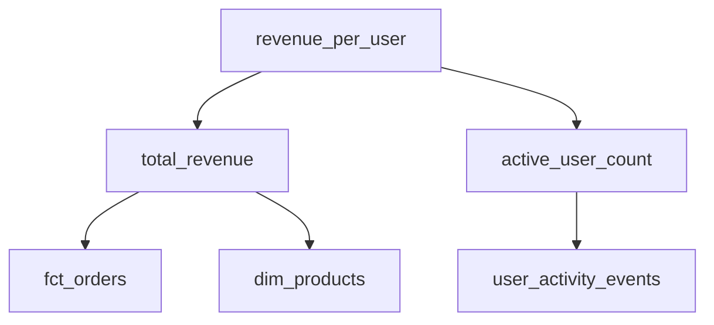

# BI Documentation Standards

## Overview

This guide establishes comprehensive documentation standards for Business Intelligence assets, ensuring consistency, discoverability, and maintainability across the organization's data ecosystem.

**Key References:**
- dbt Labs Documentation Best Practices
- Airbnb's Minerva Metric Store
- Google's Data Governance Framework
- Locally Optimistic Blog (Data Team Documentation)

---

## Table of Contents

1. [Data Dictionary Standards](#data-dictionary-standards)
2. [Dashboard Documentation](#dashboard-documentation)
3. [Metric Definition Documentation](#metric-definition-documentation)
4. [Data Lineage Documentation](#data-lineage-documentation)
5. [ETL/ELT Pipeline Documentation](#etlelt-pipeline-documentation)
6. [Data Quality Documentation](#data-quality-documentation)
7. [Documentation Maintenance](#documentation-maintenance)

---

## Data Dictionary Standards

### Purpose
Data dictionaries serve as the single source of truth for understanding data assets, their structure, meaning, and relationships.

### Required Fields for Each Table

```yaml
table_name: dim_customer
business_owner: Customer Analytics Team
technical_owner: data-engineering@company.com
description: >
  Slowly Changing Dimension (Type 2) containing customer master data.
  Tracks customer attributes over time with effective dating.
classification: Confidential
refresh_frequency: Daily at 2:00 AM UTC
row_count_estimate: ~2.5M rows
last_updated: 2024-01-15
retention_policy: 7 years per regulatory compliance
dependencies:
  - source.salesforce.accounts
  - source.stripe.customers
business_rules:
  - Customers are considered active if last_purchase_date within 365 days
  - Email addresses are hashed for PII protection in non-production environments
```

### Required Fields for Each Column

```yaml
column_name: customer_lifetime_value
data_type: DECIMAL(12,2)
nullable: true
description: >
  Total revenue generated by customer across all orders, calculated as
  sum of order_total from fact_orders where customer_id matches.
business_definition: >
  Lifetime Value (LTV) represents the total net revenue attributed to
  a customer from first purchase through current date.
calculation_logic: |
  SUM(fact_orders.order_total)
  WHERE fact_orders.customer_id = dim_customer.customer_id
  AND fact_orders.order_status IN ('completed', 'shipped')
valid_values:
  min: 0.00
  max: 999999.99
  typical_range: 50.00 - 5000.00
example_values:
  - 1247.83
  - 523.50
  - 12450.00
pii_flag: false
tags:
  - revenue
  - customer-analytics
  - kpi
version_added: "2.1.0"
deprecated: false
```

### Column Description Best Practices

**DO:**
- Start with what the field represents in business terms
- Include calculation methodology for derived fields
- Specify valid value ranges and typical distributions
- Note any quirks, edge cases, or known limitations
- Reference related fields or dependencies

**DON'T:**
- Simply restate the column name ("customer_id is the customer ID")
- Use technical jargon without business context
- Leave descriptions empty or generic
- Forget to update when logic changes

**Examples:**

❌ **Poor:**
```
order_date: The date of the order
```

✅ **Good:**
```
order_date: Date when customer submitted the order, in America/New_York timezone.
For subscription orders, this is the initial order date, not renewal dates.
Used as the primary grain for sales reporting and cohort analysis.
```

### Data Dictionary Template (dbt)

```yaml
# models/schema.yml
version: 2

models:
  - name: fct_orders
    description: |
      **Grain**: One row per order
      **Refresh**: Daily at 2 AM UTC
      **Owner**: analytics-eng@company.com

      Order fact table containing all completed orders with dimensions and measures.
      This is the source of truth for revenue reporting and customer analysis.

    meta:
      owner: analytics-eng@company.com
      tier: tier_1
      contains_pii: true
      retention_days: 2555  # 7 years

    columns:
      - name: order_id
        description: |
          Unique identifier for each order. Generated by source system at order creation.
          Format: ORD-YYYYMMDD-XXXXXX
        tests:
          - unique
          - not_null

      - name: customer_id
        description: |
          Foreign key to dim_customers. Null for guest checkout orders (~8% of total).
          Guest orders are excluded from cohort analysis but included in revenue metrics.
        tests:
          - relationships:
              to: ref('dim_customers')
              field: customer_id
              where: "customer_id IS NOT NULL"

      - name: order_total_usd
        description: |
          Total order amount in USD including tax and shipping, excluding refunds.

          **Calculation**: item_subtotal + tax_amount + shipping_amount
          **Currency**: Always USD (converted at order_timestamp rate)
          **Refunds**: Handled separately in refunds table, not reflected here
          **Discounts**: Applied before this total (see discount_amount column)
        tests:
          - not_null
          - dbt_utils.accepted_range:
              min_value: 0
              max_value: 100000
              inclusive: true
```

---

## Dashboard Documentation

### Dashboard Metadata Template

Every dashboard must include documentation accessible via info icon or separate doc page:

```markdown
# Dashboard: Monthly Sales Performance

## Overview
**Purpose:** Track monthly sales metrics across regions and product lines
**Audience:** Sales Leadership, Regional Managers, Revenue Operations
**Update Frequency:** Daily at 6:00 AM EST
**Data Freshness:** Previous business day (T-1)
**Owner:** Sales Analytics Team (sales-analytics@company.com)
**Created:** 2023-06-15
**Last Modified:** 2024-01-10

## Business Context

This dashboard supports monthly sales reviews and quarterly business reviews (QBRs).
It answers key questions:
- Are we on track to hit monthly sales targets?
- Which regions are over/under performing?
- What products are driving growth?

## Key Metrics Defined

### Total Sales Revenue
- **Definition:** Sum of all closed-won opportunities in reporting period
- **Calculation:** `SUM(amount) WHERE stage = 'Closed Won'`
- **Currency:** USD (converted at close date exchange rate)
- **Excludes:** Cancelled deals, pending approvals, renewals (see ARR dashboard)

### Sales Target Attainment
- **Definition:** Actual sales as percentage of monthly quota
- **Calculation:** `(actual_sales / monthly_quota) * 100`
- **Quota Source:** Targets set in Annual Operating Plan, adjusted quarterly
- **Threshold:** 90%+ is green, 70-89% yellow, <70% red

### Average Deal Size
- **Definition:** Mean value of closed-won deals
- **Calculation:** `AVG(amount) WHERE stage = 'Closed Won'`
- **Typical Range:** $15K - $45K
- **Outlier Handling:** Deals >$500K excluded as enterprise outliers

## Data Sources

| Data Element | Source System | Refresh | Latency |
|--------------|---------------|---------|---------|
| Opportunity Data | Salesforce | Hourly | 1 hour |
| Sales Quotas | Google Sheets (Sales Ops) | Weekly | Manual |
| Exchange Rates | xe.com API | Daily | 24 hours |
| Product Hierarchy | SAP MDM | Weekly | 7 days |

## Filters and Parameters

### Region Filter
- **Options:** North America, EMEA, APAC, LATAM
- **Default:** All Regions
- **Behavior:** Cascades to all visualizations

### Date Range
- **Type:** Relative date filter
- **Default:** Current month-to-date
- **Options:** MTD, QTD, YTD, Custom Range
- **Fiscal Calendar:** Yes (fiscal year starts Feb 1)

## Known Limitations

- **Data Lag:** Salesforce data delayed up to 1 hour during peak load
- **Missing Data:** APAC region quotas not available before Q3 2023
- **Edge Cases:** Deals split across regions show in both (over-counting risk)
- **Performance:** Large custom date ranges (>12 months) may timeout

## Troubleshooting

**Q: Why don't numbers match Salesforce reports?**
A: Our dashboard uses closed_date, while standard SFDC reports use created_date.

**Q: Why is the quota attainment different from my manager's spreadsheet?**
A: Ensure you're comparing same time period and region. Manager sheets may include pipeline.

**Q: Dashboard not loading?**
A: Check data refresh status in admin panel. Contact #data-support if refresh failed.

## Change Log

| Date | Change | Modified By |
|------|--------|-------------|
| 2024-01-10 | Added product line breakdown | jsmith@company.com |
| 2023-11-05 | Updated quota calculation logic | bwilliams@company.com |
| 2023-09-20 | Added APAC region filter | mjones@company.com |

## Related Resources

- [Sales Metrics Glossary](link)
- [Sales Operations Handbook](link)
- [Data Refresh Schedule](link)
- [Request Dashboard Changes](link)
```

### Dashboard Naming Convention

Format: `[Department] - [Subject] - [Granularity/Type]`

**Examples:**
- `Sales - Revenue Performance - Executive Summary`
- `Marketing - Campaign Attribution - Detailed Analysis`
- `Finance - P&L Statement - Monthly Reporting`
- `Operations - Inventory Levels - Real-time Monitoring`

### Dashboard Screenshot Documentation

Include annotated screenshots showing:
1. **Key interaction points**: Filters, drill-downs, exports
2. **Data refresh indicator**: Where to check last update time
3. **Metric definitions**: How to access tooltips/help
4. **Common workflows**: Step-by-step for typical use cases

---

## Metric Definition Documentation

### Inspiration: Airbnb's Minerva Approach

Airbnb's Minerva metric store emphasizes:
1. **Single source of truth** for metric definitions
2. **Semantic layer** abstracting business logic from technical implementation
3. **Version control** for metric definitions
4. **Ownership and stewardship** clearly defined

### Metric Documentation Template

```yaml
metric_id: monthly_recurring_revenue
display_name: Monthly Recurring Revenue (MRR)
category: Revenue
subcategory: Subscription Metrics

owner:
  business: VP of Revenue Operations
  technical: Data Engineering Team
  slack_channel: "#revenue-analytics"

description: >
  Total predictable revenue from active subscriptions normalized to monthly value.
  MRR is the foundation metric for subscription business health and growth tracking.

business_logic: >
  Sum of all active subscription values normalized to monthly amounts.
  - Annual subscriptions divided by 12
  - Quarterly subscriptions divided by 3
  - Monthly subscriptions counted as-is
  - Usage-based components excluded
  - One-time fees excluded

technical_definition:
  sql: |
    SELECT
      DATE_TRUNC('month', report_date) AS metric_month,
      SUM(
        CASE
          WHEN billing_frequency = 'annual' THEN subscription_value / 12
          WHEN billing_frequency = 'quarterly' THEN subscription_value / 3
          WHEN billing_frequency = 'monthly' THEN subscription_value
          ELSE 0
        END
      ) AS mrr
    FROM fact_subscriptions
    WHERE subscription_status = 'active'
      AND subscription_type = 'recurring'
    GROUP BY 1

  dimensions:
    - customer_segment
    - product_tier
    - region
    - acquisition_channel

  grain: Daily snapshot, aggregated monthly

  filters:
    - name: Active Subscriptions Only
      logic: subscription_status = 'active'
    - name: Recurring Only
      logic: subscription_type = 'recurring'

data_sources:
  primary: prod.analytics.fact_subscriptions
  dependencies:
    - prod.staging.stripe_subscriptions
    - prod.staging.salesforce_contracts

validation_rules:
  - rule: MRR should always be positive
    check: mrr >= 0
  - rule: Month-over-month change should not exceed 30%
    check: ABS((current_mrr - prior_mrr) / prior_mrr) <= 0.30
  - rule: Total MRR should match subscription sum
    check: sum(mrr) = sum(subscription_mrr)

interpretation_guide:
  typical_value: $1.2M - $1.8M (as of Q4 2023)
  target_growth: 10-15% MoM
  red_flags:
    - MRR decline >5% MoM without known churn event
    - Large variance between accounting and analytics MRR

  related_metrics:
    - ARR (Annual Recurring Revenue): MRR * 12
    - ARPU (Avg Revenue Per User): MRR / active_customers
    - Net Revenue Retention: (MRR_t1 - churn + expansion) / MRR_t0

changelog:
  - version: 2.1.0
    date: 2024-01-15
    changes: Added quarterly subscription normalization
    author: jdoe@company.com

  - version: 2.0.0
    date: 2023-09-01
    changes: Excluded usage-based revenue (breaking change)
    author: asmith@company.com
    migration_notes: Historical values recalculated, expect 8-12% decrease

approved_by:
  - name: Jane Smith
    role: CFO
    date: 2024-01-20
  - name: Bob Johnson
    role: VP Revenue
    date: 2024-01-18

certification:
  level: Tier 1 (Executive Reporting)
  audit_frequency: Quarterly
  last_audit: 2024-01-10
  next_audit: 2024-04-10
```

### Metric Versioning

All metric definitions must be version controlled:

```
/metrics
  /revenue
    mrr.v2.1.0.yml
    arr.v1.2.0.yml
    ltv.v3.0.0.yml
  /customer
    churn_rate.v1.1.0.yml
```

Version format: `MAJOR.MINOR.PATCH`
- **MAJOR:** Breaking change in calculation logic (recalc history)
- **MINOR:** Addition of new dimension or non-breaking enhancement
- **PATCH:** Bug fix, documentation update, no logic change

### Metric Dependency Graph

Document metric relationships:



**YAML representation:**
```yaml
metric_name: revenue_per_user
depends_on:
  metrics:
    - total_revenue
    - active_user_count
  tables:
    - prod.analytics.fct_orders
    - prod.analytics.dim_users
  upstream_systems:
    - Stripe (payment processing)
    - Segment (event tracking)
```

---

## Data Lineage Documentation

### Importance

Data lineage provides:
- **Impact analysis:** What breaks if I change this table?
- **Root cause analysis:** Where did this data originate?
- **Compliance:** Audit trail for regulatory requirements
- **Trust:** Transparency in data transformations

### Lineage Documentation Levels

#### 1. Table-Level Lineage

```yaml
table: prod.analytics.fact_sales

upstream_dependencies:
  direct:
    - prod.staging.stg_orders
    - prod.staging.stg_order_items
    - prod.staging.stg_customers
    - prod.staging.stg_products

  ultimate_sources:
    - source.postgres.orders (transactional DB)
    - source.postgres.order_items (transactional DB)
    - source.salesforce.accounts (CRM)
    - source.internal_api.product_catalog (Product DB)

downstream_dependencies:
  direct:
    - prod.analytics.agg_daily_sales
    - prod.analytics.customer_lifetime_value
    - prod.analytics.product_performance

  dashboards:
    - "Sales - Executive Dashboard"
    - "Finance - Revenue Recognition"
    - "Product - SKU Performance"

  reverse_etl:
    - salesforce.opportunity_scoring
    - marketo.customer_segmentation

transformation_summary: >
  Joins order data with customer and product dimensions.
  Applies business rules for revenue recognition.
  Calculates derived metrics (margin, discount rate).
```

#### 2. Column-Level Lineage

For critical metrics, document column-level lineage:

```yaml
column: fact_sales.total_revenue

lineage:
  - source: stg_orders.order_total
    transformation: None (passthrough)

  - source: stg_orders.discount_amount
    transformation: Subtracted from order_total
    logic: order_total - discount_amount

  - source: stg_orders.tax_amount
    transformation: Excluded (revenue is pre-tax)

  - source: stg_order_items.item_price
    transformation: Aggregated for validation
    logic: Used to verify order_total accuracy

calculation:
  formula: order_total - discount_amount - refund_amount
  business_rules:
    - Cancelled orders excluded (status != 'cancelled')
    - Returns reduce revenue in period processed
    - Multi-currency converted to USD at order_date rate
```

### Automated Lineage Tools

Integrate with automated lineage tools and document accordingly:

**dbt:** Use `{{ ref() }}` and `{{ source() }}` for automatic lineage
**Alation:** Manual lineage supplemented with catalog entries
**Collibra:** Data lineage diagrams with business context
**Monte Carlo:** Data observability with lineage impact

### Lineage Visualization

Include visual lineage diagrams for complex transformations:

```
[Source: Stripe API]
       ↓
[Raw: raw.stripe.subscriptions]
       ↓
[Staging: stg_stripe_subscriptions] ←── [Source: Salesforce]
       ↓                                         ↓
[Intermediate: int_subscriptions_enhanced] ←────┘
       ↓
[Analytics: fct_subscriptions]
       ↓
[Metrics: monthly_recurring_revenue]
       ↓
[Dashboard: "SaaS Metrics Executive View"]
```

---

## ETL/ELT Pipeline Documentation

### Pipeline Overview Template

```markdown
# Pipeline: Salesforce to Analytics Warehouse

## Architecture

**Pattern:** ELT (Extract-Load-Transform)
**Orchestration:** Apache Airflow
**Schedule:** Hourly (15 minutes past hour)
**Duration:** ~12 minutes average
**SLA:** Complete within 30 minutes of scheduled start

## Data Flow

```
Salesforce API (Source)
  ↓ [Fivetran Connector]
Raw Database (raw.salesforce.*)
  ↓ [dbt: Staging Models]
Staging Layer (staging.stg_salesforce_*)
  ↓ [dbt: Intermediate Models]
Intermediate Layer (intermediate.int_*)
  ↓ [dbt: Analytics Models]
Analytics Layer (analytics.dim_*, analytics.fact_*)
  ↓ [Reverse ETL: Census]
Salesforce (Enriched Fields)
```

## Pipeline Stages

### Stage 1: Extraction (Fivetran)
- **Connector:** Salesforce API v52
- **Method:** Incremental (based on SystemModstamp)
- **Objects Synced:**
  - Account (full sync daily, incremental hourly)
  - Opportunity (incremental)
  - OpportunityLineItem (incremental)
  - User (full sync daily)
- **API Limits:** 50,000 calls/day (currently using ~25K)
- **Error Handling:** Automatic retry 3x, then alert to #data-alerts

### Stage 2: Staging (dbt)
- **Purpose:** Rename, recast, basic cleansing
- **Models:** 12 staging models
- **Key Transformations:**
  - Timestamp conversion to UTC
  - Column renaming to snake_case
  - Type casting (text to numeric for IDs)
  - Deduplication based on Id and SystemModstamp
- **Testing:** Uniqueness, not_null, relationships, accepted_values

### Stage 3: Intermediate (dbt)
- **Purpose:** Business logic, joins, calculations
- **Models:** 8 intermediate models
- **Key Transformations:**
  - Join opportunities with accounts
  - Calculate derived fields (deal_age, days_in_stage)
  - Apply business rules (valid_opportunity criteria)
  - Enrich with product hierarchy

### Stage 4: Analytics (dbt)
- **Purpose:** Final dimensional models
- **Models:**
  - dim_account (SCD Type 2)
  - dim_opportunity_snapshot (daily snapshot)
  - fact_opportunity_history (historical state tracking)
- **Grain:** One row per opportunity per day
- **Materialization:** Incremental with merge strategy

## Monitoring and Alerts

### Data Quality Checks

```yaml
checks:
  - name: Row Count Variance
    threshold: +/- 15% from 7-day average
    severity: warning
    alert: #data-quality

  - name: Primary Key Uniqueness
    threshold: 100% unique
    severity: critical
    alert: #data-alerts (PagerDuty)

  - name: Freshness
    threshold: Data within 2 hours
    severity: critical
    alert: #data-alerts (PagerDuty)

  - name: Schema Changes
    threshold: 0 unexpected columns
    severity: warning
    alert: #data-engineering

  - name: Null Critical Fields
    fields: [account_id, opportunity_id, close_date, amount]
    threshold: 0% null
    severity: critical
    alert: #data-alerts
```

### Performance Metrics

Track and document:
- **Execution Time:** P50, P95, P99 percentiles
- **Row Processing Rate:** Rows per second
- **Resource Utilization:** CPU, memory, warehouse credits
- **Failure Rate:** Percentage of runs that fail
- **Recovery Time:** Time to resolve failures

## Failure Scenarios and Runbooks

### Scenario: Salesforce API Rate Limit Exceeded

**Symptoms:**
- Fivetran connector paused
- Error: "API_CURRENTLY_DISABLED: API rate limit exceeded"

**Resolution:**
1. Check Salesforce API usage dashboard
2. Identify high-consumption processes
3. If urgent: Request temporary limit increase from SFDC admin
4. If recurring: Reduce sync frequency or split to multiple connectors

**Prevention:** Monitor API usage daily, set alerts at 70% threshold

### Scenario: dbt Model Failure - Unique Test

**Symptoms:**
- dbt test fails on uniqueness check
- Duplicate records in staging table

**Resolution:**
1. Query to identify duplicate records
2. Check source data for true duplicates vs. sync issue
3. If source issue: Fix in source system, re-sync
4. If sync issue: Dedup with row_number() in staging model
5. Document pattern if recurring

**Prevention:** Add freshness check before transformation

## Change Management

All pipeline changes must follow:
1. **Development:** Test in dev environment with production data sample
2. **Code Review:** Minimum 1 reviewer from data engineering
3. **Staging Deploy:** Deploy to staging, validate with 24hr data
4. **Documentation:** Update this doc and dbt model docs
5. **Production Deploy:** Deploy during low-usage window
6. **Monitoring:** Watch for 48 hours post-deploy

## Disaster Recovery

**Backup Strategy:**
- **Raw Data:** Retained 30 days in Fivetran history
- **Transformed Data:** Incremental snapshots in S3 (90 days)
- **Code:** Git repository with tagged releases

**Recovery Time Objective (RTO):** 4 hours
**Recovery Point Objective (RPO):** 1 hour

**Recovery Procedure:**
1. Identify failure point (extraction, transformation, loading)
2. Restore from last known good state
3. Replay incremental updates from backup
4. Validate data integrity
5. Resume normal operations
```

---

## Data Quality Documentation

### Data Quality Dimensions

Document quality along six dimensions:

1. **Completeness:** Are all expected records present?
2. **Accuracy:** Does data reflect reality correctly?
3. **Consistency:** Are values consistent across systems?
4. **Timeliness:** Is data fresh enough for its purpose?
5. **Validity:** Do values conform to expected formats/ranges?
6. **Uniqueness:** Are there unexpected duplicates?

### Quality Checks Template

```yaml
table: fact_orders

quality_checks:
  - dimension: Completeness
    check_name: Daily Order Count
    logic: COUNT(*) WHERE order_date = CURRENT_DATE
    expected_range: [800, 1500]
    business_rule: Typical daily orders 800-1500, weekends 400-800
    alert_threshold: <700 or >2000
    severity: high

  - dimension: Accuracy
    check_name: Revenue Reconciliation
    logic: Compare sum(order_total) to payment processor daily batch
    tolerance: +/- $100
    frequency: Daily
    severity: critical

  - dimension: Consistency
    check_name: Customer Exists
    logic: All customer_id must exist in dim_customer
    expected: 100% match
    severity: critical

  - dimension: Timeliness
    check_name: Data Freshness
    logic: MAX(updated_at) should be within 1 hour
    expected: <= 1 hour lag
    severity: high

  - dimension: Validity
    check_name: Order Total Positive
    logic: order_total >= 0 AND order_total <= 100000
    expected: 100% within range
    severity: medium

  - dimension: Uniqueness
    check_name: Unique Order ID
    logic: COUNT(DISTINCT order_id) = COUNT(*)
    expected: 100% unique
    severity: critical
```

### Data Quality Scorecards

Track data quality metrics over time:

```markdown
# Data Quality Scorecard: fct_orders

| Month | Completeness | Accuracy | Consistency | Timeliness | Validity | Uniqueness | Overall |
|-------|--------------|----------|-------------|------------|----------|------------|---------|
| Jan   | 99.8%        | 99.9%    | 100%        | 99.5%      | 99.7%    | 100%       | 99.8%   |
| Feb   | 99.9%        | 99.8%    | 100%        | 99.7%      | 99.8%    | 100%       | 99.9%   |
| Mar   | 99.7%        | 99.9%    | 100%        | 99.6%      | 99.9%    | 100%       | 99.8%   |

**Target:** 99.5% overall quality score
**Status:** ✓ Meeting target
```

---

## Documentation Maintenance

### Ownership Model

**Data Producers:** Teams creating data assets own documentation
- Data Engineering: Pipeline and infrastructure docs
- Analytics Engineering: dbt model and transformation docs
- Business Intelligence: Dashboard and metric docs
- Data Science: Model and experiment docs

**Documentation Review Cycle:**
- **Monthly:** Review critical metrics and executive dashboards
- **Quarterly:** Review all production dashboards and core tables
- **Annually:** Full documentation audit and cleanup

### Documentation Standards Checklist

Before deploying any new BI asset:

- [ ] Data dictionary entries for all new tables/columns
- [ ] Metric definitions added to metric store
- [ ] Dashboard documentation page created
- [ ] Data lineage documented
- [ ] Quality checks configured
- [ ] Owner assigned
- [ ] Runbook created (for complex pipelines)
- [ ] Change log initiated
- [ ] Peer review completed

### Documentation Templates Location

All templates available at:
```
/docs/templates/
  table_documentation_template.yml
  dashboard_documentation_template.md
  metric_definition_template.yml
  pipeline_documentation_template.md
```

### Deprecated Asset Handling

When deprecating BI assets:

1. **Mark as Deprecated:** Add prominent warning in documentation
2. **Set Sunset Date:** Communicate 90-day timeline
3. **Identify Alternatives:** Document replacement asset
4. **Archive:** Move to `/deprecated/` folder with retention policy
5. **Maintain Docs:** Keep documentation for 2 years post-deprecation

Example deprecation notice:
```markdown
⚠️ **DEPRECATED as of 2024-03-01**
This dashboard will be sunset on 2024-06-01.
**Replacement:** Use "Sales - Revenue Performance v2" (link)
**Reason:** New dashboard includes product line breakdown and improved performance
**Questions:** Contact analytics-team@company.com
```

---

## Tools and Automation

### Documentation Generation

**dbt:** Use dbt docs generate for automated schema documentation
```yaml
# In schema.yml
models:
  - name: fact_orders
    description: |
      {{ doc("fact_orders_overview") }}
    columns:
      - name: order_id
        description: Unique identifier for order
        tests:
          - unique
          - not_null
```

**Data Catalog Integration:**
- **Alation:** API to push dbt docs to catalog
- **Atlan:** Sync via metadata API
- **Collibra:** Import via CSV or API

### Documentation Quality Metrics

Track and report:
- **Coverage:** % of tables/columns with descriptions
- **Staleness:** Days since last documentation update
- **Completeness:** % of required fields populated
- **Usage:** Page views of documentation

**Target KPIs:**
- 100% of production tables documented
- 90%+ of columns have descriptions
- 95%+ of dashboards have documentation pages
- Documentation updated within 7 days of asset change

---

## References and Further Reading

1. **dbt Best Practices**
   - [How we structure our dbt projects](https://docs.getdbt.com/guides/best-practices/how-we-structure/1-guide-overview)
   - [dbt Documentation Guide](https://docs.getdbt.com/docs/collaborate/documentation)

2. **Airbnb's Minerva**
   - [Airbnb's Minerva: A metric platform for data governance](https://medium.com/airbnb-engineering/how-airbnb-achieved-metric-consistency-at-scale-f23cc53dea70)

3. **Data Governance**
   - "Data Governance: How to Design, Deploy and Sustain an Effective Data Governance Program" by John Ladley
   - "The Data Warehouse Toolkit" by Ralph Kimball (dimensional modeling)

4. **Industry Standards**
   - DAMA-DMBOK: Data Management Body of Knowledge
   - DCAM: Data Management Capability Assessment Model

---

**Document Version:** 1.0.0
**Last Updated:** 2024-01-15
**Maintained By:** Data Platform Team
**Review Frequency:** Quarterly
