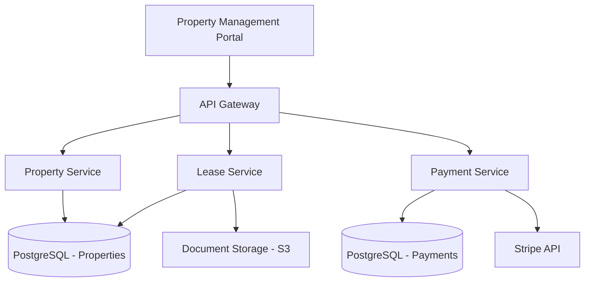
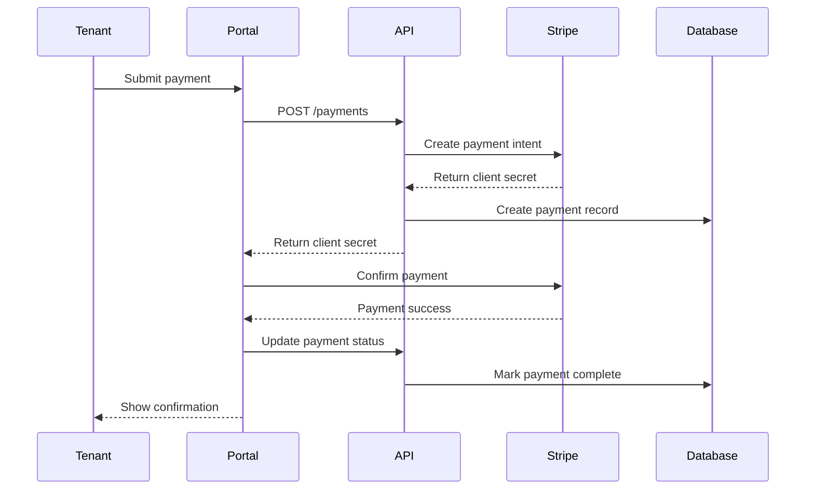
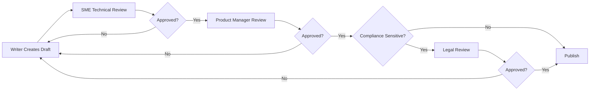

# PropTech Documentation Standards

**Version:** 2.1
**Last Updated:** 2025-01-15
**Status:** Active Standard
**Authority:** PropTech Documentation Committee
**References:** Microsoft Writing Style Guide, Google Developer Documentation Style Guide, Write the Docs

## Table of Contents

1. [Overview](#overview)
2. [Documentation Types](#documentation-types)
3. [Documentation Structure](#documentation-structure)
4. [Writing Style and Voice](#writing-style-and-voice)
5. [Technical Writing Standards](#technical-writing-standards)
6. [API Documentation](#api-documentation)
7. [Code Documentation](#code-documentation)
8. [User Documentation](#user-documentation)
9. [Visual Standards](#visual-standards)
10. [Accessibility Requirements](#accessibility-requirements)
11. [Localization Guidelines](#localization-guidelines)
12. [Version Control and Publishing](#version-control-and-publishing)
13. [Review and Approval Process](#review-and-approval-process)

## Overview

This document establishes comprehensive documentation standards for PropTech applications, ensuring consistency, clarity, and compliance across all documentation types. These standards align with industry best practices from Stripe, Twilio, AWS, and leading property management platforms like Yardi and RealPage.

### Documentation Principles

1. **User-Centered**: Write for your audience's technical level and use cases
2. **Actionable**: Focus on helping users accomplish specific tasks
3. **Accurate**: Ensure technical accuracy through SME reviews
4. **Accessible**: Meet WCAG 2.2 Level AA standards
5. **Maintainable**: Structure documentation for easy updates and version control
6. **Discoverable**: Optimize for search and logical navigation

### Audience Segmentation

| Audience | Technical Level | Primary Needs | Documentation Type |
|----------|----------------|---------------|-------------------|
| **Property Managers** | Low-Medium | Task completion, troubleshooting | User guides, tutorials, FAQs |
| **Maintenance Staff** | Low | Mobile workflows, photo uploads | Quick reference, mobile guides |
| **Leasing Agents** | Low-Medium | Tenant applications, lease signing | Process guides, video tutorials |
| **Accountants** | Medium | Financial reporting, reconciliation | Reports guide, data definitions |
| **Property Owners** | Low | Portfolio analytics, distributions | Dashboard guides, reports |
| **System Administrators** | High | Configuration, integrations, security | Admin guides, architecture docs |
| **API Developers** | High | Integration, authentication, webhooks | API reference, SDKs, code examples |
| **DevOps Engineers** | High | Deployment, monitoring, scaling | Operations guides, runbooks |

## Documentation Types

### 1. API Documentation

**Purpose:** Enable developers to integrate with PropTech platform APIs

**Required Sections:**
- Authentication and authorization
- Endpoint reference (all methods, parameters, responses)
- Error codes and troubleshooting
- Rate limits and quotas
- Webhooks and event types
- SDKs and client libraries
- Code examples in multiple languages
- Postman/OpenAPI collections
- Changelog and migration guides

**Format:** Markdown + OpenAPI 3.0 specification

**Examples:**
- Stripe API Documentation: https://stripe.com/docs/api
- Yardi API Documentation (WebServices)
- Buildium API: https://api.buildium.com/

**Template Location:** `/templates/api-documentation-template.md`

### 2. User Guides

**Purpose:** Help end users accomplish tasks within the application

**Types:**
- **Getting Started Guide**: First-time setup, initial configuration
- **Feature Guides**: Deep dives into specific features (lease management, rent collection)
- **Workflow Guides**: Step-by-step processes (tenant application to lease signing)
- **Admin Guides**: System configuration, user management, permissions
- **Troubleshooting Guides**: Common issues and solutions

**Format:** Markdown with embedded screenshots/videos

**Structure:**
```markdown
# [Feature Name]: [Task/Goal]

## Overview
Brief description of what this guide covers and who it's for.

## Prerequisites
- Required permissions
- Required setup steps
- Required data

## Step-by-Step Instructions

### Step 1: [Action]
1. Navigate to [Location]
2. Click [Button/Link]
3. Enter [Information]

[Screenshot with annotations]

### Step 2: [Action]
...

## Expected Results
What users should see when complete.

## Troubleshooting
Common issues and solutions.

## Related Articles
Links to related documentation.
```

### 3. Admin Documentation

**Purpose:** Enable system administrators to configure and manage the platform

**Required Sections:**
- User management and permissions model
- Organization/multi-tenancy setup
- Integration configuration (Yardi, MRI, QuickBooks)
- Security settings (SSO, 2FA, IP allowlisting)
- Data retention and archival policies
- Audit log access and interpretation
- Custom fields and workflow configuration
- Reporting and analytics setup

**Access Control:** Restricted to admin-role users

### 4. Compliance Documentation

**Purpose:** Document compliance with regulations and standards

**Types:**
- **Fair Housing Compliance**: Screening procedures, advertising guidelines
- **PCI DSS Compliance**: Payment data handling, tokenization
- **Data Privacy Compliance**: GDPR, CCPA, tenant data handling
- **Accessibility Compliance**: WCAG 2.2 conformance, Section 508
- **Security Documentation**: SOC 2, ISO 27001, penetration testing
- **Financial Compliance**: Audit trails, reconciliation procedures

**Format:** PDF for formal compliance reports, Markdown for policies

**Review Cycle:** Quarterly or upon regulation changes

### 5. Architecture Documentation

**Purpose:** Document system design for engineers and architects

**Required Sections:**
- System architecture diagrams (C4 model)
- Data flow diagrams
- Database schema (ER diagrams)
- Integration architecture
- Security architecture
- Deployment architecture
- Disaster recovery and backup procedures
- Scalability and performance characteristics

**Tools:**
- Diagrams: Mermaid, PlantUML, Lucidchart
- Database: dbdiagram.io, dbdocs.io
- Architecture: C4 model (Structurizr)

**Example:**


### 6. Runbooks and Operational Guides

**Purpose:** Enable on-call engineers to respond to incidents

**Required Sections:**
- Service overview and dependencies
- Health check endpoints and expected responses
- Common alerts and resolution steps
- Rollback procedures
- Emergency contacts and escalation paths
- Performance baselines and SLAs
- Disaster recovery procedures

**Format:** Markdown in repository, synced to incident management tool

**Example Structure:**
```markdown
# Runbook: Payment Processing Service

## Service Overview
- **Purpose**: Process rent payments via Stripe and ACH
- **SLA**: 99.9% uptime
- **Dependencies**: Stripe API, PostgreSQL, Redis cache

## Health Checks
- **Endpoint**: `GET /health`
- **Expected Response**: `200 OK` with `{"status": "healthy"}`

## Alert: High Payment Failure Rate

**Trigger**: Payment failure rate > 5% over 15 minutes

**Impact**: Tenants cannot pay rent, revenue at risk

**Diagnosis**:
1. Check Stripe API status: https://status.stripe.com
2. Query recent failures: `SELECT * FROM payments WHERE status = 'failed' AND created_at > NOW() - INTERVAL '1 hour'`
3. Review error codes in logs

**Resolution**:
- If Stripe API issue: Monitor Stripe status, communicate with tenants
- If database issue: Check connection pool, restart service if needed
- If validation issue: Review recent code changes, consider rollback

**Escalation**: Page payments-team if issue persists > 30 minutes
```

### 7. Release Notes and Changelogs

**Purpose:** Communicate product changes to users and developers

**Format:** Keep a Changelog format (https://keepachangelog.com/)

**Categories:**
- **Added**: New features
- **Changed**: Changes to existing functionality
- **Deprecated**: Soon-to-be-removed features
- **Removed**: Removed features
- **Fixed**: Bug fixes
- **Security**: Security fixes

**Example:**
```markdown
# Changelog

## [2.5.0] - 2025-01-15

### Added
- Automated lease renewal workflow with configurable notice periods
- Bulk rent posting for month-end processing
- Mobile app support for maintenance work orders with photo uploads
- Integration with Yardi Voyager for property sync

### Changed
- Late fee calculation now prorates based on days late (previously flat fee)
- Payment processing now supports split payments for roommates

### Fixed
- Fixed issue where security deposit refunds showed incorrect tax calculations
- Corrected occupancy rate calculation for properties with commercial units

### Security
- Implemented rate limiting on authentication endpoints to prevent brute force attacks
- Updated dependencies to patch OpenSSL vulnerability CVE-2024-XXXX

## [2.4.1] - 2024-12-20

### Fixed
- Resolved memory leak in background job processor
- Fixed timezone handling for lease expiration notifications
```

### 8. Training Materials

**Purpose:** Onboard new users and provide ongoing education

**Types:**
- **Video Tutorials**: Screen recordings with narration (5-10 minutes each)
- **Interactive Demos**: Guided walkthroughs with sample data
- **Quick Reference Cards**: 1-page printable guides for common tasks
- **Webinar Recordings**: Monthly feature highlights and Q&A
- **Certification Programs**: Structured learning paths for power users

**Formats:**
- Videos: MP4 (H.264), hosted on Vimeo/YouTube with closed captions
- Interactive: Pendo, WalkMe, or Appcues
- PDFs: Accessible PDFs with tagged structure

**Tracking:** LMS integration to track completion and quiz scores

## Documentation Structure

### Information Architecture

**Three-Tier Navigation:**

```
Level 1: Documentation Type
├── Getting Started
├── User Guides
│   ├── Property Management
│   ├── Lease Management
│   ├── Tenant Portal
│   ├── Payments & Accounting
│   └── Maintenance & Work Orders
├── Admin Guides
│   ├── User & Permissions
│   ├── Integrations
│   └── Configuration
├── API Documentation
│   ├── Authentication
│   ├── Properties API
│   ├── Leases API
│   └── Payments API
└── Developer Guides
    ├── Getting Started
    ├── Architecture
    └── Integration Patterns

Level 2: Feature/Module

Level 3: Specific Task/Endpoint
```

### File Naming Convention

```
# User Guides
user-guide-[module]-[task].md
user-guide-lease-management-create-lease.md
user-guide-payments-process-refund.md
user-guide-maintenance-create-work-order.md

# Admin Guides
admin-guide-[topic].md
admin-guide-user-permissions.md
admin-guide-yardi-integration.md

# API Documentation
api-[resource]-[version].md
api-properties-v1.md
api-leases-v1.md

# Architecture
arch-[component].md
arch-data-model.md
arch-authentication.md
```

### Document Metadata

Include YAML frontmatter in all Markdown documents:

```yaml
---
title: "Creating a New Lease Agreement"
description: "Step-by-step guide to creating a residential lease agreement"
audience: "Property Managers, Leasing Agents"
difficulty: "Beginner"
estimated_time: "10 minutes"
version: "2.5"
last_updated: "2025-01-15"
author: "docs-team@proptech.com"
tags: ["lease", "residential", "getting-started"]
related_docs:
  - "user-guide-lease-management-edit-lease.md"
  - "user-guide-lease-management-terminate-lease.md"
video_tutorial: "https://vimeo.com/123456789"
---
```

## Writing Style and Voice

### Voice and Tone

**Voice Characteristics (Consistent Across All Docs):**
- Professional yet approachable
- Clear and concise
- Authoritative without being condescending
- User-focused (use "you" to address reader)

**Tone Variations by Document Type:**

| Document Type | Tone | Example |
|--------------|------|---------|
| User Guides | Friendly, encouraging | "You're all set! Your lease is now active." |
| API Docs | Technical, precise | "The `lease_start_date` parameter must be in ISO 8601 format." |
| Admin Guides | Instructive, cautious | "⚠️ Changing this setting affects all users in your organization." |
| Runbooks | Urgent, action-oriented | "Immediately check the Stripe API status dashboard." |
| Release Notes | Neutral, informative | "Lease renewal notifications now support custom message templates." |

### Grammar and Mechanics

**Active Voice:** Use active voice to clarify who performs actions

❌ "The late fee will be calculated by the system."
✅ "The system calculates the late fee automatically."

**Present Tense:** Use present tense for current features

❌ "When you clicked Save, the lease will be created."
✅ "When you click Save, the system creates the lease."

**Second Person:** Address the reader as "you"

❌ "Users can export the rent roll report."
✅ "You can export the rent roll report."

**Contractions:** Use sparingly in user guides, avoid in API documentation

✅ User Guide: "If you don't see the property, check your filters."
✅ API Docs: "If you do not receive a webhook within 24 hours, poll the endpoint."

### Terminology Consistency

**Maintain a Glossary:**

| Preferred Term | Avoid | Context |
|---------------|-------|---------|
| Property | Building, Complex, Site | Physical real estate asset |
| Unit | Apartment, Space | Individual rentable space |
| Tenant | Renter, Lessee | Person renting a unit |
| Lease | Rental Agreement, Contract | Legal rental document |
| Move-in Date | Start Date, Commencement | Actual move-in date |
| Lease Start Date | - | Legal lease commencement |
| Security Deposit | Damage Deposit | Refundable deposit |
| Work Order | Ticket, Request | Maintenance request |
| Property Manager | PM, Manager | Person managing property |
| Owner | Landlord, Investor | Property owner |

**Industry Acronyms (Spell Out First Use):**

First use: "Property Management System (PMS)"
Subsequent: "PMS"

Common PropTech Acronyms:
- **MLS**: Multiple Listing Service
- **RESO**: Real Estate Standards Organization
- **RETS**: Real Estate Transaction Standard
- **NOI**: Net Operating Income
- **Cap Rate**: Capitalization Rate
- **PMS**: Property Management System
- **BAS**: Building Automation System
- **HVAC**: Heating, Ventilation, and Air Conditioning
- **AVM**: Automated Valuation Model

## Technical Writing Standards

### Procedures and Task Documentation

**Use Numbered Lists for Sequential Steps:**

```markdown
## How to Create a Lease

1. Navigate to **Leases** > **Create New Lease**.
2. Select the property from the dropdown menu.
3. Select the unit you want to lease.
4. Enter the tenant information:
   - First name
   - Last name
   - Email address
   - Phone number
5. Set the lease terms:
   - Lease start date
   - Lease end date
   - Monthly rent amount
   - Security deposit amount
6. Review the lease details.
7. Click **Create Lease**.

**Result:** The lease is created with a status of "Draft." You can now add additional terms or activate the lease.
```

**Use Bulleted Lists for Non-Sequential Items:**

```markdown
## Lease Status Types

The system supports the following lease statuses:

- **Draft**: Lease is being prepared, not yet active
- **Active**: Lease is currently in effect
- **Expired**: Lease end date has passed
- **Terminated**: Lease ended early
- **Renewed**: Lease was renewed with new terms
```

### Code Examples

**Provide Context for Code:**

❌ Poor Example:
```javascript
fetch('/api/properties/123')
```

✅ Good Example:
```javascript
// Fetch property details by ID
const propertyId = 'prop_2zXj9mK8vN';
const response = await fetch(`https://api.proptech.com/v1/properties/${propertyId}`, {
  headers: {
    'Authorization': `Bearer ${apiKey}`,
    'Content-Type': 'application/json'
  }
});

const property = await response.json();
console.log(property.property_name); // "Sunset Towers"
```

**Include Multiple Language Examples:**

````markdown
## Example: Create a Lease

### JavaScript

```javascript
const stripe = require('stripe')('sk_test_...');

const lease = await fetch('https://api.proptech.com/v1/leases', {
  method: 'POST',
  headers: {
    'Authorization': `Bearer ${apiKey}`,
    'Content-Type': 'application/json'
  },
  body: JSON.stringify({
    property_id: 'prop_2zXj9mK8vN',
    unit_id: 'unit_abc123',
    tenant_id: 'tenant_xyz789',
    lease_start_date: '2025-02-01',
    lease_end_date: '2026-01-31',
    monthly_rent_amount: 2500,
    security_deposit_amount: 2500
  })
});

const data = await lease.json();
console.log(data.id); // "lease_def456"
```

### Python

```python
import requests

api_key = 'your_api_key'
url = 'https://api.proptech.com/v1/leases'

headers = {
    'Authorization': f'Bearer {api_key}',
    'Content-Type': 'application/json'
}

payload = {
    'property_id': 'prop_2zXj9mK8vN',
    'unit_id': 'unit_abc123',
    'tenant_id': 'tenant_xyz789',
    'lease_start_date': '2025-02-01',
    'lease_end_date': '2026-01-31',
    'monthly_rent_amount': 2500,
    'security_deposit_amount': 2500
}

response = requests.post(url, headers=headers, json=payload)
lease = response.json()
print(lease['id'])  # "lease_def456"
```

### cURL

```bash
curl https://api.proptech.com/v1/leases \
  -H "Authorization: Bearer your_api_key" \
  -H "Content-Type: application/json" \
  -d '{
    "property_id": "prop_2zXj9mK8vN",
    "unit_id": "unit_abc123",
    "tenant_id": "tenant_xyz789",
    "lease_start_date": "2025-02-01",
    "lease_end_date": "2026-01-31",
    "monthly_rent_amount": 2500,
    "security_deposit_amount": 2500
  }'
```
````

### Tables

**Use Tables for Comparisons and Reference Data:**

```markdown
## Property Types

| Property Type | Description | Typical Use Cases | Example Properties |
|--------------|-------------|-------------------|-------------------|
| Multifamily | 5+ residential units | Apartments, condos | Garden-style, high-rise |
| Single Family | Detached home | Rental houses | SFR portfolios |
| Commercial | Business spaces | Retail, office | Shopping centers, office buildings |
| Mixed Use | Residential + Commercial | Urban developments | Live-work spaces |
| Student Housing | Purpose-built student | University housing | Dorms, student apartments |
```

### Admonitions and Callouts

**Use Consistent Formatting for Warnings, Tips, and Notes:**

```markdown
> **ℹ️ Note**
>
> Lease start dates must be at least 7 days in the future to allow for tenant screening.

> **💡 Tip**
>
> Use the bulk rent posting feature to process all rent charges at once at month-end.

> **⚠️ Warning**
>
> Terminating a lease cannot be undone. Ensure you have documented the reason for termination.

> **🚨 Caution**
>
> Changing the rent calculation method affects all future rent charges for this property.

> **✅ Best Practice**
>
> Always upload a signed copy of the lease to the document library after tenant signatures.
```

## API Documentation

### OpenAPI/Swagger Specification

All APIs must have a corresponding OpenAPI 3.0 specification:

```yaml
openapi: 3.0.0
info:
  title: PropTech Platform API
  version: 1.0.0
  description: |
    The PropTech Platform API enables you to manage properties, units, leases, tenants, and payments programmatically.

    ## Authentication

    All API requests require authentication using an API key passed in the `Authorization` header:

    ```
    Authorization: Bearer your_api_key
    ```

    ## Rate Limits

    - **Free Tier**: 100 requests per minute
    - **Pro Tier**: 1,000 requests per minute
    - **Enterprise Tier**: Custom limits

  contact:
    name: API Support
    email: api@proptech.com
    url: https://docs.proptech.com

servers:
  - url: https://api.proptech.com/v1
    description: Production
  - url: https://api-staging.proptech.com/v1
    description: Staging

paths:
  /properties:
    get:
      summary: List properties
      description: Returns a paginated list of properties
      operationId: listProperties
      tags:
        - Properties
      parameters:
        - name: limit
          in: query
          description: Number of results per page
          schema:
            type: integer
            minimum: 1
            maximum: 100
            default: 20
        - name: city
          in: query
          description: Filter by city
          schema:
            type: string
      responses:
        '200':
          description: Successful response
          content:
            application/json:
              schema:
                type: object
                properties:
                  data:
                    type: array
                    items:
                      $ref: '#/components/schemas/Property'
                  has_more:
                    type: boolean
                  total_count:
                    type: integer

components:
  schemas:
    Property:
      type: object
      properties:
        id:
          type: string
          example: "prop_2zXj9mK8vN"
        property_name:
          type: string
          example: "Sunset Towers"
        property_type:
          type: string
          enum: [multifamily, single_family, commercial, mixed_use]
        total_units:
          type: integer
          minimum: 1
        created_at:
          type: string
          format: date-time
```

### API Reference Format

```markdown
## Create Lease

Creates a new lease agreement for a unit.

**Endpoint:** `POST /v1/leases`

**Authentication:** Required

**Request Body:**

| Parameter | Type | Required | Description |
|-----------|------|----------|-------------|
| `property_id` | string | Yes | ID of the property |
| `unit_id` | string | Yes | ID of the unit to lease |
| `tenant_id` | string | Yes | ID of the tenant |
| `lease_start_date` | string (date) | Yes | Lease start date (ISO 8601: YYYY-MM-DD) |
| `lease_end_date` | string (date) | Yes | Lease end date (must be after start date) |
| `monthly_rent_amount` | integer | Yes | Monthly rent in cents (e.g., 250000 for $2,500.00) |
| `security_deposit_amount` | integer | Yes | Security deposit in cents |
| `pet_deposit_amount` | integer | No | Pet deposit in cents (if applicable) |
| `metadata` | object | No | Arbitrary key-value pairs |

**Response:**

Returns a `Lease` object if successful.

**Status Codes:**

- `201 Created`: Lease created successfully
- `400 Bad Request`: Invalid parameters
- `401 Unauthorized`: Missing or invalid API key
- `404 Not Found`: Property, unit, or tenant not found
- `409 Conflict`: Unit already has an active lease for this date range
- `429 Too Many Requests`: Rate limit exceeded

**Example Request:**

[See code examples above]

**Example Response:**

```json
{
  "id": "lease_def456",
  "object": "lease",
  "property_id": "prop_2zXj9mK8vN",
  "unit_id": "unit_abc123",
  "tenant_id": "tenant_xyz789",
  "lease_status": "draft",
  "lease_start_date": "2025-02-01",
  "lease_end_date": "2026-01-31",
  "monthly_rent_amount": 250000,
  "security_deposit_amount": 250000,
  "created_at": "2025-01-15T10:30:00Z",
  "updated_at": "2025-01-15T10:30:00Z"
}
```

**Errors:**

```json
{
  "error": {
    "type": "validation_error",
    "code": "lease_dates_overlap",
    "message": "Unit unit_abc123 already has an active lease from 2025-01-01 to 2025-12-31",
    "param": "lease_start_date"
  }
}
```
```

## Visual Standards

### Screenshots

**Requirements:**
- **Resolution**: Minimum 1920x1080 (retina: 2x or 3x)
- **Format**: PNG for UI screenshots, JPEG for photos
- **Compression**: Use TinyPNG or similar to reduce file size
- **Annotations**: Use red boxes/arrows for emphasis (tools: Snagit, CloudApp)
- **Consistency**: Same browser, same theme, same data set

**File Naming:**
```
screenshot-[feature]-[view]-[element].png
screenshot-lease-create-form.png
screenshot-property-list-filters.png
screenshot-payment-process-success.png
```

**Alt Text:**
```markdown

```

**Annotations:**
- Use red boxes to highlight UI elements
- Use numbered callouts for multi-step processes
- Keep annotations minimal and clear
- Match brand colors (avoid default tool colors)

### Diagrams

**Architecture Diagrams:**
- Use Mermaid for simple diagrams (embedded in Markdown)
- Use Lucidchart/Draw.io for complex diagrams
- Export as SVG for scalability
- Use consistent color scheme (brand colors)
- Include legend for symbols

**Example Mermaid Diagram:**



### Video Standards

**Technical Specifications:**
- **Resolution**: 1920x1080 minimum
- **Frame Rate**: 30fps
- **Format**: MP4 (H.264 codec)
- **Audio**: 44.1kHz, stereo, normalized to -16 LUFS
- **Length**: 5-10 minutes per video (shorter is better)

**Content Requirements:**
- **Intro**: 5-second title card with topic
- **Narration**: Clear, professional voiceover (avoid filler words: "um," "uh")
- **Captions**: Closed captions (SRT/VTT) for accessibility
- **Outro**: 5-second card with link to related docs
- **Branding**: Logo watermark in corner

**Hosting:**
- Primary: Vimeo Business (for embedding with controls)
- Alternative: YouTube (unlisted, for broader reach)
- Backup: S3/CloudFront for self-hosting

## Accessibility Requirements

### WCAG 2.2 Level AA Compliance

All documentation must meet WCAG 2.2 Level AA standards:

**1. Perceivable**

✅ **Text Alternatives:**
- All images have descriptive alt text
- Complex diagrams have long descriptions
- Videos have captions and transcripts

✅ **Color Contrast:**
- Text contrast ratio minimum 4.5:1 (normal text)
- Text contrast ratio minimum 3:1 (large text 18pt+)
- Don't rely on color alone to convey information

❌ "Click the red button to continue"
✅ "Click the **Delete** button (red) to continue"

**2. Operable**

✅ **Keyboard Navigation:**
- All interactive elements accessible via keyboard
- Logical tab order
- Skip navigation links

✅ **Timing:**
- No time limits on reading
- Videos have play/pause controls

**3. Understandable**

✅ **Readable:**
- Reading level: 8th grade or lower (use Hemingway Editor)
- Language attribute set in HTML: `<html lang="en">`
- Expand acronyms on first use

✅ **Predictable:**
- Consistent navigation across all docs
- Consistent terminology
- Clear headings and structure

**4. Robust**

✅ **Compatible:**
- Valid HTML5
- Semantic markup (use `<nav>`, `<main>`, `<article>`)
- ARIA labels where needed

### Accessibility Testing

**Tools:**
- **WAVE**: Browser extension for accessibility testing
- **axe DevTools**: Automated accessibility testing
- **Screen Readers**: Test with NVDA (Windows), VoiceOver (Mac)
- **Keyboard Only**: Navigate docs using only keyboard

## Localization Guidelines

### Internationalization (i18n)

**Supported Languages (Priority Order):**
1. English (US) - en-US (primary)
2. Spanish (Mexico) - es-MX
3. French (Canada) - fr-CA
4. Portuguese (Brazil) - pt-BR
5. Simplified Chinese - zh-CN

**File Structure:**
```
docs/
├── en-US/
│   ├── user-guides/
│   ├── api-docs/
│   └── admin-guides/
├── es-MX/
│   ├── user-guides/
│   ├── api-docs/
│   └── admin-guides/
└── locales.json
```

**Translation Workflow:**
1. Write source content in en-US
2. Export to XLIFF or JSON for translation
3. Send to translation service (Smartling, Phrase)
4. Review translated content with native speakers
5. Import and publish localized versions

**Localization Considerations:**

❌ **Avoid:**
- Idioms and colloquialisms ("ballpark figure")
- Culture-specific references
- Embedded text in images
- Hardcoded date/number formats

✅ **Use:**
- Simple, clear language
- Universal examples
- Separate text from images (use captions)
- Locale-aware formatting (use i18n libraries)

**Currency and Units:**
- Use ISO currency codes: USD, MXN, CAD
- Provide conversions where helpful
- Use metric and imperial measurements

**Date and Time:**
- Use ISO 8601 format in technical docs: 2025-01-15T10:30:00Z
- Use localized formats in user docs: "January 15, 2025" (en-US), "15 janvier 2025" (fr-CA)

## Version Control and Publishing

### Documentation Repository Structure

```
docs-repo/
├── content/
│   ├── user-guides/
│   ├── admin-guides/
│   ├── api-docs/
│   └── developer-guides/
├── images/
│   ├── screenshots/
│   └── diagrams/
├── videos/
├── templates/
├── scripts/
│   ├── build.sh
│   └── deploy.sh
├── .github/
│   └── workflows/
│       ├── build-and-deploy.yml
│       └── link-checker.yml
├── mkdocs.yml (or docusaurus.config.js)
└── README.md
```

### Git Workflow

**Branching Strategy:**
- `main`: Published documentation (protected branch)
- `develop`: Staging/preview environment
- `feature/[ticket-number]-[description]`: Feature branches

**Commit Message Format:**
```
type(scope): subject

[optional body]

[optional footer]

Types:
- docs: Documentation changes
- fix: Correct errors, broken links
- feat: New documentation
- update: Update existing docs
- style: Formatting, no content change
- refactor: Reorganize structure

Examples:
docs(api): add webhook signature verification guide
fix(user-guide): correct screenshot for lease creation flow
update(admin): revise user permissions matrix
```

### Continuous Integration

**Automated Checks (GitHub Actions):**

```yaml
# .github/workflows/docs-ci.yml
name: Documentation CI

on:
  pull_request:
    branches: [main, develop]
  push:
    branches: [main]

jobs:
  build:
    runs-on: ubuntu-latest
    steps:
      - uses: actions/checkout@v3

      - name: Build documentation
        run: |
          npm install
          npm run build

      - name: Check broken links
        uses: lycheeverse/lychee-action@v1
        with:
          args: --verbose --no-progress 'content/**/*.md'

      - name: Vale linting
        uses: errata-ai/vale-action@v2
        with:
          files: content

      - name: Check spelling
        uses: rojopolis/spellcheck-github-actions@0.24.0
        with:
          config_path: .spellcheck.yml

      - name: Accessibility check
        run: npm run a11y-check

      - name: Deploy preview
        if: github.event_name == 'pull_request'
        run: npm run deploy-preview
```

### Publishing Workflow

**Manual Review Checklist:**
- [ ] Technical accuracy verified by SME
- [ ] Screenshots current and annotated
- [ ] Code examples tested and working
- [ ] Links checked and valid
- [ ] Spelling and grammar checked
- [ ] Accessibility validated (WAVE, axe)
- [ ] Mobile responsive design tested
- [ ] SEO metadata complete (title, description, keywords)

**Automated Deployment:**
- Merge to `main` triggers production deploy
- Cloudflare Pages / Netlify / Vercel for static site hosting
- CDN for global performance
- Versioned URLs: `docs.proptech.com/v2.5/`

### Versioning Strategy

**Documentation Versions Align with Product Versions:**

```
docs.proptech.com/          → Latest stable version (2.5)
docs.proptech.com/v2.5/     → Version 2.5 (current)
docs.proptech.com/v2.4/     → Version 2.4 (previous)
docs.proptech.com/v2.3/     → Version 2.3 (archived)
docs.proptech.com/latest/   → Always redirects to current stable
```

**Version Indicator:**
Add version selector to all documentation pages

**Deprecation Notices:**
```markdown
> **⚠️ Deprecation Notice**
>
> This version of the API (v1) is deprecated and will be sunset on June 30, 2025.
>
> Please migrate to [API v2](/v2/api-docs/) before this date.
>
> See the [Migration Guide](/v2/api-docs/migration-from-v1/) for details.
```

## Review and Approval Process

### Roles and Responsibilities

| Role | Responsibilities | Approval Authority |
|------|------------------|-------------------|
| **Technical Writer** | Create, update documentation | Draft content |
| **Subject Matter Expert (SME)** | Review technical accuracy | Technical approval |
| **Product Manager** | Review feature descriptions, use cases | Product approval |
| **Legal/Compliance** | Review compliance content | Legal approval (required for compliance docs) |
| **Localization Team** | Translate and localize content | Translation approval |
| **Documentation Manager** | Final review, publication | Publication approval |

### Review Workflow



### Review SLAs

| Document Type | Review SLA | Approval SLA |
|--------------|-----------|--------------|
| Minor Update (< 100 words) | 1 business day | 1 business day |
| Standard Update | 3 business days | 2 business days |
| New Feature Guide | 5 business days | 3 business days |
| API Documentation | 5 business days | 3 business days |
| Compliance Documentation | 7 business days | 5 business days (includes legal) |
| Architecture Documentation | 7 business days | 5 business days |

### Feedback and Continuous Improvement

**User Feedback Mechanisms:**
- "Was this helpful?" widget on every page
- Comment system (Disqus, GitHub Discussions)
- Support ticket analysis (identify documentation gaps)
- Analytics (track bounce rates, time on page, search queries)

**Quarterly Documentation Audit:**
- Review analytics for low-performing pages
- Update outdated screenshots and examples
- Remove deprecated features
- Improve SEO for high-traffic pages
- Solicit user feedback via surveys

---

## Tools and Resources

### Documentation Tools

**Static Site Generators:**
- **MkDocs Material**: Markdown-based, excellent search, versioning
- **Docusaurus**: React-based, popular for API docs
- **GitBook**: Commercial, great for team collaboration

**API Documentation:**
- **Stoplight**: Visual OpenAPI editor, mock servers
- **ReadMe**: Interactive API docs with metrics
- **Redoc**: OpenAPI renderer, clean design

**Diagrams:**
- **Mermaid**: Text-to-diagram, embedded in Markdown
- **Lucidchart**: Professional diagramming
- **Draw.io**: Free, open-source diagramming

**Screenshots:**
- **Snagit**: Professional screenshot editing
- **CloudApp**: Quick screen capture and annotation
- **Shottr**: Mac screenshot tool with annotations

**Video:**
- **Loom**: Quick screen recording with webcam
- **Camtasia**: Professional video editing
- **ScreenFlow**: Mac screen recording and editing

### Style and Quality Tools

**Writing:**
- **Grammarly**: Grammar and style checking
- **Hemingway Editor**: Readability scoring
- **Vale**: Prose linting (enforce style guide rules)

**Accessibility:**
- **WAVE**: Web accessibility evaluation
- **axe DevTools**: Automated accessibility testing
- **Pa11y**: Automated accessibility testing CLI

**Link Checking:**
- **Lychee**: Fast link checker
- **Broken Link Checker**: Node.js link validator

---

## References

1. **Microsoft Writing Style Guide**: https://docs.microsoft.com/en-us/style-guide/
2. **Google Developer Documentation Style Guide**: https://developers.google.com/style
3. **Write the Docs**: https://www.writethedocs.org/
4. **WCAG 2.2**: https://www.w3.org/WAI/WCAG22/quickref/
5. **Stripe API Documentation**: https://stripe.com/docs/api
6. **Twilio Documentation Standards**: https://www.twilio.com/docs
7. **Keep a Changelog**: https://keepachangelog.com/

---

## Version History

- **2.1** (2025-01-15): Added video standards, enhanced localization guidelines
- **2.0** (2024-10-01): Added WCAG 2.2 compliance, API documentation standards
- **1.5** (2024-06-01): Enhanced accessibility requirements, added review workflow
- **1.0** (2024-01-01): Initial release

---

*This document is maintained by the PropTech Documentation Committee. For questions or updates, contact docs@proptech.com.*
